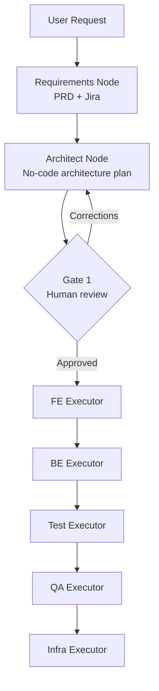

# SDLC Agentic Pipeline

AI-native SDLC workflow built on LangGraph with pluggable LLM providers (`anthropic`, `openai_compatible`, `ollama`, `stub`).

Current flow:

1. Requirements generation (Confluence PRD + Jira tickets)
2. Architecture plan generation (no code)
3. Gate 1 human review
4. FE -> BE -> Test -> QA -> Infra execution

---

## Architecture



---

## What Is Actual Now

The active graph entrypoint is `requirements` (not `planner`).

Active nodes in order:

- `requirements_node`
- `architect_node`
- `fe_executor_node`
- `be_executor_node`
- `test_executor_node`
- `qa_executor_node`
- `infra_executor_node`

`planner.py` remains in the repo as legacy/deprecated and is not wired by `graph.py`.

---

## Prerequisites

- Python 3.11+
- One LLM path configured in `.env`:
  - Anthropic key, or
  - OpenAI-compatible endpoint + key, or
  - Ollama local runtime, or
  - `stub` mode (no external LLM API calls)

---

## Setup

```bash
# 1) Clone
git clone https://github.com/cgarbacea/sdlc-agentic.git
cd sdlc-agentic

# 2) Virtual env
python -m venv venv
source venv/bin/activate

# 3) Install dependencies
pip install -r requirements.txt

# 4) Configure env
cp .env.example .env
# Edit .env values

# 5) Build/rebuild RAG index after docs changes
python build_knowledge_base.py
```

---

## How To Use

```bash
# Check effective provider and missing env vars only
python main.py --provider-check-only

# Interactive run
python main.py

# Feature from CLI
python main.py --feature "Add dark mode toggle"

# CI-style run (auto-approve Gate 1)
python main.py --feature "Add dark mode toggle" --non-interactive

# Print provider check, then run
python main.py --provider-check --feature "Add dark mode toggle"

# Resume a paused run from SQLite checkpoints
python main.py --thread-id <existing-thread-id>

# Run lightweight health endpoint for probes
make run-health
# then check: http://127.0.0.1:8081/health
```

Notes:

- `--provider-check` and `--provider-check-only` validate required env vars by provider and show the effective provider.
- Preflight checks env presence/config only; they do not validate remote API quota or key billing status.
- Transient LLM/tool call failures use retry/backoff settings from `.env`:
  - `RETRY_MAX_ATTEMPTS`
  - `RETRY_BASE_DELAY_SECONDS`
  - `RETRY_MAX_DELAY_SECONDS`

Provider examples:

```bash
# Local no-cost execution path
LLM_PROVIDER=stub python main.py --feature "stub smoke" --non-interactive

# OpenAI-compatible mode
LLM_PROVIDER=openai_compatible python main.py --provider-check-only

# Ollama mode
LLM_PROVIDER=ollama python main.py --provider-check-only
```

---

## Verify README Against Runtime

Use these commands to verify what is documented here is still true:

```bash
# 1) Provider preflight works
python main.py --provider-check-only

# 2) Graph imports and compiles
python -c "from graph import app; print('graph OK')"

# 3) End-to-end no-cost smoke run
LLM_PROVIDER=stub python main.py --feature "stub mode smoke test" --non-interactive

# 4) Checkpoint resume path (replace with a known paused thread)
python main.py --thread-id <existing-thread-id>
```

Expected results:

- Provider check prints configured/effective provider and missing env vars
- Graph check prints `graph OK`
- Stub run completes requirements -> architect -> Gate 1 -> executors without API key failures
- Resume command continues a paused run using persisted SQLite checkpoint state

---

## CI Workflows (PR Validation)

This repo includes two GitHub Actions workflow templates:

- `.github/workflows/agent-pr-validation.yml`
  - Minimal PR validator
  - Runs Python sanity compile + ArchUnit validation
  - Fails the workflow if checks fail

- `.github/workflows/agent-pr-validation-with-comment.yml`
  - Same validation behavior as above
  - Also posts/updates a PR comment with ArchUnit PASS/FAIL and last output lines
  - Still fails the workflow when ArchUnit fails (branch protection remains effective)

### Porting Checklist for Target Monorepo

When moving these workflows into your target monorepo, update the following:

1. `BACKEND_PATH`

- Set to the backend project path inside that monorepo.
- Example: `apps/backend-modulith` or `services/backend`.

2. `ARCHUNIT_CMD`

- Set to the exact ArchUnit command used by that backend.
- Maven example: `./mvnw -q -Dtest=*ArchUnit* test`
- Gradle example: `./gradlew test --tests *ArchUnit*`

3. Java version

- Update `actions/setup-java` version if target backend requires a different JDK.

4. Python sanity compile step

- Keep it if the monorepo contains this SDLC agent code.
- Remove or adapt it if those files are not in the target repository.

5. Permissions (comment variant only)

- Ensure workflow has `pull-requests: write` and `issues: write`.
- Without these permissions, PR comments cannot be created/updated.

6. Branch protection / required checks

- Add this workflow job as a required status check so failing ArchUnit blocks merges.

### Recommended Rollout

1. Start with `agent-pr-validation.yml` in the target monorepo.
2. Confirm `BACKEND_PATH` and `ARCHUNIT_CMD` are correct on 1-2 PRs.
3. Switch to `agent-pr-validation-with-comment.yml` if you want inline PR feedback.

### Copy-Paste Example (Target Monorepo)

If your backend module is under `apps/backend-modulith`, use this workflow env block:

```yaml
env:
  BACKEND_PATH: apps/backend-modulith
  ARCHUNIT_CMD: ./mvnw -q -Dtest=*ArchUnit* test
```

If your backend uses Gradle instead of Maven:

```yaml
env:
  BACKEND_PATH: apps/backend-modulith
  ARCHUNIT_CMD: ./gradlew test --tests '*ArchUnit*'
```

Optional trigger filter for monorepo performance (run only when backend/agent/workflow files change):

```yaml
on:
  pull_request:
    types: [opened, synchronize, reopened, ready_for_review]
    paths:
      - "apps/backend-modulith/**"
      - ".github/workflows/agent-pr-validation*.yml"
      - "main.py"
      - "graph.py"
      - "nodes/be_executor.py"
```

---

## Project Structure

```text
sdlc-agentic/
├── main.py
├── graph.py
├── state.py
├── config.py
├── llm_factory.py
├── build_knowledge_base.py
├── nodes/
│   ├── requirements_node.py
│   ├── architect_node.py
│   ├── fe_executor.py
│   ├── be_executor.py
│   ├── test_executor.py
│   ├── qa_executor.py
│   ├── infra_executor.py
│   └── planner.py              # legacy/deprecated
├── prompts/
├── tools/
├── docs/
├── guideline/
└── .env.example
```

---

## License

MIT
