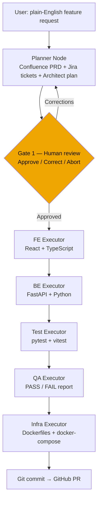

# SDLC Agentic Pipeline

A multi-agent SDLC pipeline built with **LangGraph** and **Claude Sonnet**. Takes a plain-English feature request and autonomously produces a plan, frontend code, backend code, tests, a QA report, and infrastructure config — with human review gates at critical points.

---

## Architecture



---

## What Each Node Does

| Node                  | Role               | Output                                                |
| --------------------- | ------------------ | ----------------------------------------------------- |
| `planner_node`        | Lead Architect     | Confluence PRD, Jira tickets, architectural plan      |
| `fe_executor_node`    | Frontend Developer | React/TypeScript components written to FE repo        |
| `be_executor_node`    | Backend Developer  | FastAPI endpoints written to BE repo                  |
| `test_executor_node`  | QA Engineer        | pytest + vitest tests for generated code              |
| `qa_executor_node`    | QA Architect       | Structured PASS/FAIL report against coding guidelines |
| `infra_executor_node` | DevOps Engineer    | Dockerfiles and docker-compose                        |

---

## Three Layers of Agent Control (Defense in Depth)

| Layer            | What it does                                             | Where it lives         |
| ---------------- | -------------------------------------------------------- | ---------------------- |
| **Prompts**      | Persona and rules for each executor                      | `prompts/*.md`         |
| **RAG**          | Company knowledge base — coding standards, guidelines    | `rag_db/`, `docs/*.md` |
| **Orchestrator** | Hard structural check — QA executor validates all output | `nodes/qa_executor.py` |

---

## Prerequisites

- Python 3.11+
- An Anthropic API key (`claude-sonnet-4-5` or later)

---

## Setup

```bash
# 1. Clone
git clone https://github.com/cgarbacea/sdlc-agentic.git
cd sdlc-agentic

# 2. Create virtual environment
python -m venv venv
source venv/bin/activate        # macOS/Linux
# venv\Scripts\activate         # Windows

# 3. Install dependencies
pip install -r requirements.txt

# 4. Configure environment
cp .env.example .env
# Edit .env — add your ANTHROPIC_API_KEY and output paths

# 5. Build the RAG knowledge base (run once, re-run when docs/ changes)
python build_knowledge_base.py
```

---

## Run

```bash
python main.py
```

The pipeline will:

1. Ask you for a feature description
2. Run the Planner and show you the generated plan
3. **Pause at Gate 1** — you review, approve, or correct the plan
4. Execute all remaining nodes autonomously
5. Write code to the configured output paths

---

## Project Structure

```
sdlc-agentic/
├── main.py                     # Entry point + HITL gate loop
├── graph.py                    # LangGraph workflow definition
├── state.py                    # Shared SDLCState TypedDict
├── config.py                   # LLM and config helpers
├── build_knowledge_base.py     # RAG ingestion script
│
├── nodes/                      # Agent nodes
│   ├── planner.py
│   ├── fe_executor.py
│   ├── be_executor.py
│   ├── test_executor.py
│   ├── qa_executor.py
│   └── infra_executor.py
│
├── prompts/                    # System prompts (edit to change agent behaviour)
│   ├── be_executor.md
│   ├── fe_executor.md
│   ├── infra_executor.md
│   ├── qa_executor.md
│   └── test_executor.md
│
├── tools/                      # Tools available to agents
│   ├── filesystem.py           # read_file, write_file, list_directory
│   ├── jira.py                 # create_jira_ticket (mocked → local .md)
│   ├── confluence.py           # create_confluence_page (mocked → local .md)
│   ├── git.py                  # git_commit_to_branch (mocked)
│   └── rag.py                  # search_company_knowledge_base (ChromaDB)
│
├── docs/                       # Knowledge base source documents
│   └── clean_code_guidelines.md
│
├── guideline/                  # Project documentation
│   ├── how_i_did_it.md         # Concepts and definitions
│   ├── requirements.md         # Role requirements being implemented
│   ├── career_plan.md          # Phased build plan
│   └── ...
│
└── .env.example                # Environment variable template
```

---

## Roadmap

| Phase                  | Status     | Description                             |
| ---------------------- | ---------- | --------------------------------------- |
| POC Pipeline           | ✅ Done    | 6-node sequential pipeline working      |
| HITL Gate 1            | 🔲 Next    | Interactive plan approval loop          |
| MCP Server             | 🔲 Planned | Expose pipeline as GitHub Copilot tool  |
| Real Git / PRs         | 🔲 Planned | Agent opens real GitHub PRs             |
| Java / Spring Modulith | 🔲 Planned | Agent generates ArchUnit-compliant Java |
| Observability          | 🔲 Planned | LangSmith tracing + structured logs     |
| Golden Templates       | 🔲 Planned | cookiecutter scaffold for new projects  |

See [guideline/career_plan.md](guideline/career_plan.md) for the full roadmap.

---

## Key Concepts

See [guideline/how_i_did_it.md](guideline/how_i_did_it.md) for a plain-English explanation of every concept used: LLM, Agent, Tool, RAG, LangGraph, HITL, MCP, and more.

---

## License

MIT
