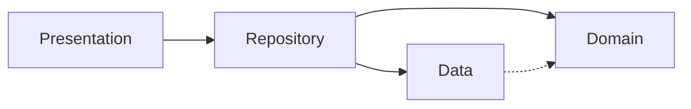

## Gate

On skill activation, emit verbatim once:

> building-flutter-apps active. Pre-flight required.

Before writing any `.dart` code, emit verbatim:

> Reading building-flutter-apps gate.

After every code change to a `.dart` file (or to `pubspec.yaml` / `build.yaml` / `analysis_options.yaml`):

1. Run `dart analyze` from the package root. Block on any ERROR or WARNING.
2. Emit the filled-in Pre-Flight checklist. T0 always. T1 / T2 only if their domain was touched.
3. If `dart analyze` is not wired with `flutter_skill_lints`, run Setup before continuing.

## Critical Rules

1. **Use `dart analyze` from package root**, never `flutter analyze` and never path-scoped. Copy [references/analysis_options.yaml](references/analysis_options.yaml) to project root and wire `flutter_skill_lints` + `riverpod_lint` under `plugins:`. `flutter analyze lib` silently drops plugin diagnostics ([flutter#184190](https://github.com/flutter/flutter/issues/184190)).

2. **Use `@riverpod` / `@Riverpod` codegen for every provider** — state, computed, repository, datasource, service, family, stream. Never manual `Provider`, `FutureProvider`, `StreamProvider`, `StateProvider`, `StateNotifierProvider`, `NotifierProvider`, `AsyncNotifierProvider`, `ChangeNotifierProvider`. Run `dart run build_runner watch --delete-conflicting-outputs`.

3. **Guard every `await`** in notifiers and repositories with `if (!ref.mounted) return;`. Guard every `await` in widgets and `State` with `if (!context.mounted) return;`. Inside `State`, never `if (mounted)` — always `if (!context.mounted) return;`. **Inside `finally`, use the guard form `if (ref.mounted) { ... }`** — never `if (!ref.mounted) return;`.

4. **Extract widgets to public classes.** No `_buildXxx()` helpers. No `class _Foo extends StatelessWidget | StatefulWidget | ConsumerWidget | ConsumerStatefulWidget | HookWidget | HookConsumerWidget`. Mark file-internal widgets `@visibleForTesting`. `_FooState extends State<Foo>` stays private (Flutter convention — exempt).

5. **Use `Object?` or a specific type** for unknown values. `dynamic` only for `Map<String, dynamic>` JSON. Never `value!` — use `if (value case final v?)`.

6. **Use `AppLocalizations` (gen-l10n)** for every user-facing string. Never hardcode UI copy in widgets, notifiers, repositories, or datasources. `*Strings` constants only for non-user-facing IDs.

7. **Use `sealed class` for Freezed unions and states.** Never `abstract class` with `@freezed`. Match with Dart native `switch` — never Freezed `.when()` / `.map()`.

8. **Never prop-drill state.** Child widgets read providers directly with `ref.watch` / `ref.read` / `ref.listen`. Do not pass entity / state / notifier instances through constructors. Constructor params allowed: immutable IDs (for routing/lookup), callbacks, `Key`, and primitive props on leaf atoms.

9. **Use a mixin when the same behavior appears in 2+ classes.** Extract to a `mixin` with an `on` clause (e.g. `mixin RetryMixin on AsyncNotifier<X>`). Suffix the name with `Mixin`. Copy-paste sharing across notifiers, widgets, or services is forbidden — replace with a mixin.

10. **Storage SDK calls live in Local Datasource, never in Notifier.** Hive (`Hive.openBox`, `box.get/put/delete`, `Hive.box`), `SharedPreferences`, `flutter_secure_storage`, `dart:io` file ops, `path_provider` directory access — all live behind a `Local<X>Datasource` interface, called by `<X>Repository`. Notifiers and widgets never import `hive_ce` / `shared_preferences` / `flutter_secure_storage` / `dart:io` / `path_provider`.

11. **Primitive manipulation lives in `core/extensions/` — never inline.** All `DateTime` / `String` / `int` / `double` / `num` / `Duration` / `Iterable` / `BuildContext` derivation (formatting, parsing, arithmetic, capitalize, truncate, diff/timeAgo, currency, percent, clamp, range, locale format) goes through extensions in `core/extensions/{date_time,string,int,double,num,duration,iterable,context}_extensions.dart`, re-exported via `core/extensions/extensions.dart`. Widgets / notifiers / repositories MUST call `date.timeAgo` / `name.capitalized` / `amount.asCurrency` / `score.clamped(0, 100)` / `count.pluralized('item')` — NEVER re-roll `DateTime.now().difference(...)`, `'${s[0].toUpperCase()}${s.substring(1)}'`, `NumberFormat.currency(...).format(...)`, or inline `value.clamp(...)` at call sites. **Why:** SSOT — one fix / locale tweak / null-safety guard updates every call site; duplication drifts. **Apply:** if same primitive op appears in 2+ files OR an extension already covers it, use the extension. Missing? Add to `core/extensions/`, export in barrel, then use. See [extensions-utilities.md](references/extensions-utilities.md).

## Trigger Map

Before writing code in any row below, output `Reading: <ref-name>` and read the listed reference(s).

| Touching                                                                                                                                                                                                                                                                                                                                                      | Read                                                                                                              |
| ------------------------------------------------------------------------------------------------------------------------------------------------------------------------------------------------------------------------------------------------------------------------------------------------------------------------------------------------------------- | ----------------------------------------------------------------------------------------------------------------- |
| Notifier, AsyncNotifier, mutation method, `ref.read` / `ref.watch` / `ref.listen`, `_ensureRepository`, async cancellation, sync `Notifier` init                                                                                                                                                                                                              | [state-management.md](references/state-management.md)                                                             |
| Freezed entity, sealed union, `fromJson` / `toJson`, `copyWith`, model vs entity, `build.yaml` for `explicit_to_json`                                                                                                                                                                                                                                         | [freezed-sealed.md](references/freezed-sealed.md)                                                                 |
| Provider declaration, `@riverpod`, family, `keepAlive`, codegen, `Mutation<T>` (experimental)                                                                                                                                                                                                                                                                 | [riverpod-codegen.md](references/riverpod-codegen.md)                                                             |
| Repository, datasource, domain entity, layered architecture, `IHttpService`, mapping models to entities                                                                                                                                                                                                                                                       | [architecture.md](references/architecture.md)                                                                     |
| GoRouter, typed route, redirect, `context.go`, deep link, cold-start, navigation gate                                                                                                                                                                                                                                                                         | [architecture.md](references/architecture.md) + [deep-linking.md](references/deep-linking.md)                     |
| HTTP, network, REST, source-of-truth fetch after mutation, transport id vs domain id                                                                                                                                                                                                                                                                          | [networking.md](references/networking.md)                                                                         |
| Atom, molecule, organism, design tokens, atomic widgets, `core/widgets/` promotion                                                                                                                                                                                                                                                                            | [atomic-design.md](references/atomic-design.md)                                                                   |
| Showcase, `AppShowcaseTarget`, `startShowCase`, replay, `ShowcaseKeys`, `ProviderSubscription` lifecycle                                                                                                                                                                                                                                                      | [showcase-tours.md](references/showcase-tours.md)                                                                 |
| Widget test, `ProviderContainer.test()`, `UncontrolledProviderScope`, fakes, mocks, `AppWidgetKeys`, event-contract tests                                                                                                                                                                                                                                     | [testing.md](references/testing.md)                                                                               |
| `flutter_driver`, Dart MCP, E2E, `integration_test`, semantic selectors, log capture                                                                                                                                                                                                                                                                          | [dart-mcp-e2e-testing.md](references/dart-mcp-e2e-testing.md)                                                     |
| Hive, `TypeAdapter`, TypeId, box, persistence migration, retired field accounting                                                                                                                                                                                                                                                                             | [hive-persistence.md](references/hive-persistence.md)                                                             |
| Crashlytics, error reporting, `Crash` facade, recoverable error classifier, symbol upload, three-hook wiring (`FlutterError.onError` + `PlatformDispatcher.instance.onError` + `Isolate.current.addErrorListener`), `runZonedGuarded` legacy (Flutter 3.3+)                                                                                                   | [crashlytics.md](references/crashlytics.md)                                                                       |
| Mixin, capability vs interface, retry helper, RNG, bulk operation                                                                                                                                                                                                                                                                                             | [mixins.md](references/mixins.md)                                                                                 |
| Service, singleton, fire-and-forget, `abstract final class`, `unawaited()`, `Future<void>` signature                                                                                                                                                                                                                                                          | [services-and-singletons.md](references/services-and-singletons.md)                                               |
| `@Preview`, `widget_previews.dart`, preview fakes, deterministic preview data                                                                                                                                                                                                                                                                                 | [widget-previews.md](references/widget-previews.md)                                                               |
| `AppLocalizations`, ARB file, gen-l10n, locale fallback, placeholders, plural / select                                                                                                                                                                                                                                                                        | [localization.md](references/localization.md)                                                                     |
| Performance, build cost, `.select()`, `const` constructors, `ListView.builder`, large list compute                                                                                                                                                                                                                                                            | [performance.md](references/performance.md) + [flutter-optimizations.md](references/flutter-optimizations.md)     |
| `LayoutBuilder`, `RenderFlex` overflow, `Expanded` / `Flexible` outside `Row` / `Column`, `Positioned` outside `Stack`, text-scale clamp                                                                                                                                                                                                                      | [layout-diagnostics.md](references/layout-diagnostics.md)                                                         |
| Extension, `SnackBarUtils`, snackbar dispatch from notifier, `@visibleForTesting` helpers, `DateTime` format/diff/timeAgo/startOfDay, `String` capitalize/truncate/titleCase/initials/format, `int` / `double` / `num` clamp/pluralized/asCurrency/percent/toFixed, `Duration` format, parse/format, `NumberFormat`, `DateFormat`, `intl`, `core/extensions/` | [extensions-utilities.md](references/extensions-utilities.md)                                                     |
| Records `(x, y)`, extension type IDs, pattern matching, guard clause `case _ when ...`                                                                                                                                                                                                                                                                        | [dart-patterns-records.md](references/dart-patterns-records.md)                                                   |
| `analysis_options.yaml`, `dart analyze`, plugin wiring, `riverpod_lint` pre-release pin, analyzer crash                                                                                                                                                                                                                                                       | [analysis-options.md](references/analysis-options.md) + [analysis_options.yaml](references/analysis_options.yaml) |
| Common navigation / form / list / debounce / route-param-fallback patterns                                                                                                                                                                                                                                                                                    | [common-patterns.md](references/common-patterns.md)                                                               |

## Core Stack

Version SSOT: [README.md → What's Included](README.md#whats-included).

| Package                                                     | Version                         | Purpose                              |
| ----------------------------------------------------------- | ------------------------------- | ------------------------------------ |
| flutter_riverpod + riverpod_annotation + riverpod_generator | `^3.3.1` / `^4.0.2` / `^4.0.3`  | State management (codegen)           |
| freezed + freezed_annotation                                | `^3.2.5` / `^3.1.0`             | Immutable data classes, unions       |
| go_router + go_router_builder                               | `^17.2.3` / `^4.3.0`            | Declarative, type-safe routing       |
| json_serializable + build_runner                            | `6.13.0` / `^2.15.0`            | JSON serialization + code generation |
| showcaseview                                                | `^5.0.2`                        | First-run guided tours               |
| hive_ce + hive_ce_flutter + hive_ce_generator               | `^2.19.3` / `^2.4.0` / `1.11.0` | Local persistence                    |

## Architecture



```
lib/
├── core/
├── features/
│   └── feature_x/
│       ├── data/           # Models, datasources (API / local)
│       ├── domain/         # Entities (pure Dart, no Flutter imports)
│       ├── repositories/   # Map models → entities
│       └── presentation/   # Notifiers, screens, widgets
└── main.dart
```

Repository returns Domain entities (never Models). Domain has no Flutter import. Datasource throws typed exceptions, never returns null on failure. `try`/`catch` lives in the Notifier — never in Domain or Datasource.

## Class Modifiers

| Modifier                   | Extend outside lib | Implement outside lib | Instantiate | Mixin |
| -------------------------- | :----------------: | :-------------------: | :---------: | :---: |
| `abstract class`           |         ✓          |           ✓           |      ✗      |   ✗   |
| `abstract interface class` |         ✗          |           ✓           |      ✗      |   ✗   |
| `abstract final class`     |         ✗          |           ✗           |      ✗      |   ✗   |
| `sealed class`             |         ✗          |           ✗           |      ✗      |   ✗   |
| `base class`               |         ✓          |           ✗           |      ✓      |   ✗   |
| `interface class`          |         ✗          |           ✓           |      ✓      |   ✗   |
| `final class`              |         ✗          |           ✗           |      ✓      |   ✗   |
| `mixin class`              |         ✓          |           ✓           |      ✓      |   ✓   |

`abstract interface class` for repository / datasource / service contracts. `sealed class` for Freezed unions. `abstract final class` for pure stateless helper namespaces (`Crash`, `Storage`).

## Code Generation

```bash
dart run build_runner watch --delete-conflicting-outputs
dart run build_runner build --delete-conflicting-outputs
dart run build_runner clean && dart run build_runner build --delete-conflicting-outputs
```

## Setup

1. Copy [references/analysis_options.yaml](references/analysis_options.yaml) to project root. It already wires `flutter_skill_lints` + `riverpod_lint` under `plugins:`.
2. `flutter_skill_lints` is an analyzer plugin — it lives **only** in `analysis_options.yaml plugins:`. Never add it to `pubspec.yaml`.
3. Run `dart pub get`. Confirm `dart analyze` exits 0.
4. Sanity check: write `Widget _buildHeader() => const SizedBox();` — `dart analyze` must flag it.

### Per-Tool Hooks

| Tool        | Auto-install command                                                                                                        | Hook source                |
| ----------- | --------------------------------------------------------------------------------------------------------------------------- | -------------------------- |
| Claude Code | `/plugin marketplace add sgaabdu4/building-flutter-apps` then `/plugin install building-flutter-apps@building-flutter-apps` | `hooks/hooks.json`         |
| Codex CLI   | `codex` → `/plugins` (add `sgaabdu4/building-flutter-apps`, install)                                                        | default `hooks/hooks.json` |
| Copilot CLI | `copilot plugin marketplace add sgaabdu4/building-flutter-apps` then `copilot plugin install building-flutter-apps`         | `hooks/hooks.copilot.json` |

Raw skill installs are guidance-only. They load this file but cannot register
runtime hooks or run scanners. Use plugin installs when enforcement matters.

## Pre-Flight

Fill T0 always after any `.dart` write. Fill T1 if state / notifier / mutation touched. Fill T2 if network / E2E / stream / showcase / route touched. Emit before yielding the turn.

### T0

- [ ] `dart analyze` exits 0 with `flutter_skill_lints` + `riverpod_lint` wired
- [ ] `if (!ref.mounted) return;` after every `await` in notifiers and repositories
- [ ] `if (!context.mounted) return;` after every `await` in widgets and `State` (no bare `if (mounted)`)
- [ ] Inside `finally`, use guard form `if (ref.mounted) { ... }` — never early-return
- [ ] No `_buildXxx()` and no private widget classes extending Stateless / Stateful / Consumer / Hook widgets (`State` subclasses exempt)
- [ ] No `dynamic` except `Map<String, dynamic>` for JSON; no `value!`
- [ ] All providers `@riverpod` codegen; no manual `Provider(...)` family
- [ ] No prop-drilling: children watch providers directly. No entity / state / notifier in constructors
- [ ] Shared behavior across 2+ classes lives in a `mixin` (suffixed `Mixin`), not copy-pasted
- [ ] No `hive_ce` / `shared_preferences` / `flutter_secure_storage` / `dart:io` / `path_provider` imports in notifier or widget files — storage goes through `Local<X>Datasource` → `<X>Repository`
- [ ] No inline `DateTime` / `String` / `int` / `double` / `num` / `Duration` manipulation outside `core/extensions/` — call existing extension or add one. Forbidden inline: capitalize via `'${s[0].toUpperCase()}${s.substring(1)}'`, `DateTime.now().difference(...)` for timeAgo, `NumberFormat.currency(...).format(...)`, `value.clamp(...)` at call site, locale-format reimplementation. Use `.capitalized` / `.timeAgo` / `.asCurrency` / `.clamped(...)` / `.pluralized(...)`

### T1 — State / Notifier / Mutation

- [ ] Mutation methods (`create*`, `update*`, `delete*`, `set*`, `reorder*`) init deps via `_ensureRepository()` / `_ensureDependencies()` lazily
- [ ] Sync `Notifier.build()` does not read `state` before first return; seed via constructor; defer async with `Future.microtask`
- [ ] `ref.onDispose()` cancels every subscription / controller / timer
- [ ] Notifier owns snackbar dispatch — widgets do not call `SnackBarUtils.show*` or `ScaffoldMessenger.of(context)`
- [ ] Long-running sync / auth / import flows guard stale async writes
- [ ] No `ref.watch` inside notifier method body — `ref.watch` in `build()` only; `ref.read` in callbacks

### T2 — Network / E2E / Stream / Showcase / Route

- [ ] Source-of-truth fetch after mutation when backend generates / normalizes / reorders / derives values
- [ ] Observer + writer E2E proof present for shared / realtime / collaborative state
- [ ] All `ValueKey` from central `AppWidgetKeys` registry — no inline string `ValueKey('...')`
- [ ] E2E entrypoint deterministic (`lib/main_dev.dart` or equivalent); test overrides isolated from `main.dart`
- [ ] GoRouter redirect logic in pure `resolveAppRedirect(...)`, matrix-tested; nullable by-id provider for route params with fallback UI
- [ ] `startShowCase()` receives full ordered `ShowcaseKeys.*Tour` list; `ProviderSubscription` stored and closed in `disposeShowcase()`
- [ ] Cross-runtime constants / schema / function contracts have drift tests
- [ ] No `MediaQuery.withClampedTextScaling` in `MaterialApp` builder

## Recap

1. `dart analyze` from package root, never `flutter analyze`. Plugin wired in `analysis_options.yaml plugins:`, never `pubspec.yaml`.
2. No `_buildXxx()`. No private widget classes extending Stateless / Stateful / Consumer / Hook. Public + `@visibleForTesting` if file-internal. `_FooState extends State<Foo>` stays private.
3. `if (!ref.mounted) return;` after EVERY `await` in notifiers and repositories. `if (!context.mounted) return;` after EVERY `await` in widgets and `State`. Never bare `if (mounted)`. **Inside `finally` blocks**, use `if (ref.mounted) { ... }` guard form, never `if (!ref.mounted) return;`.
4. Every mutation method inits deps via `_ensureRepository()` / `_ensureDependencies()`. Never rely on `build()` / `_init()` timing.
5. `sealed class` with Freezed, never `abstract class`. Dart native `switch`, never `.when()` / `.map()`.
6. No prop-drilling. Child widgets watch providers directly. No entity / state / notifier as constructor params.
7. Shared behavior across 2+ classes → `mixin XxxMixin on Y`. No copy-paste sharing.
8. Storage SDK (Hive, SharedPreferences, secure_storage, `dart:io`, `path_provider`) lives in `Local<X>Datasource`. Notifiers and widgets never import storage SDKs directly.
9. Primitive manipulation (`DateTime`, `String`, `int`, `double`, `num`, `Duration`, `Iterable`) lives in `core/extensions/` — SSOT. Inline reimpl of capitalize / timeAgo / currency / percent / clamp / locale-format is forbidden. Missing extension? Add it, export in barrel, then call.
