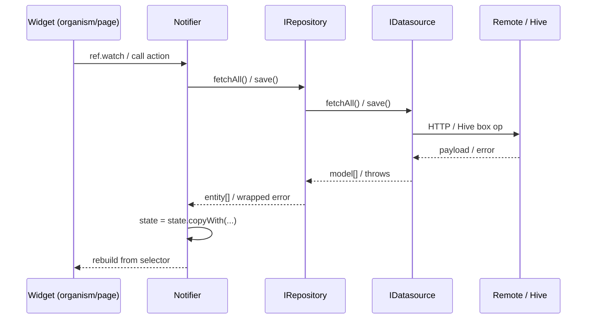
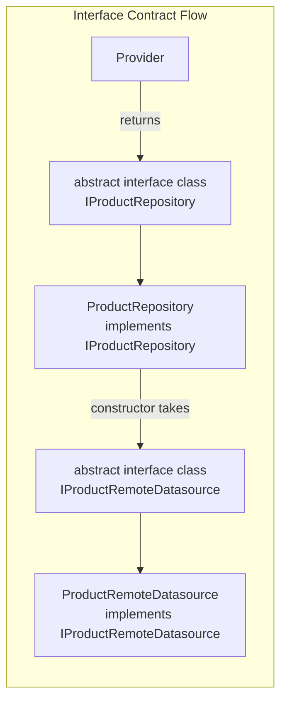

# Architecture

Flutter clean arch, four layers. Deps flow inward: Presentation → Repository → Domain → Data.

## Trigger

Signals: clean architecture, four layers, dependency inversion, domain entity, repository interface
Before generating code in this area, output verbatim: `Reading: architecture.md`


## Contents

- [Scope](#scope)
- [Tradeoffs](#tradeoffs)
- [Rules — NEVER Violate](#rules--never-violate)
- [Full Directory Structure](#full-directory-structure)
- [Layer Responsibilities](#layer-responsibilities)
  - [Domain Layer](#domain-layer)
  - [Data Layer](#data-layer)
  - [Repository Layer](#repository-layer)
  - [Presentation Layer](#presentation-layer)
- [Complexity Tiers](#complexity-tiers)
- [Design Tokens](#design-tokens)
- [Atomic Design for Widgets](#atomic-design-for-widgets)

## Scope

In: state, nav, deep links, persistence, HTTP boundaries, models/JSON, DI,
errors, forms (via [Validators](extensions-utilities.md#validators) +
[common-patterns.md](common-patterns.md)), localization, atomic widgets,
previews, codegen, tests.

Out: backend-vendor SDK specifics, full design-system authoring, and a11y
beyond `Semantics` notes in [atomic-design.md](atomic-design.md#accessibility).
HTTP service internals are covered at boundary level in
[networking.md](networking.md).



## Tradeoffs

- **Atomic hierarchy** — overhead under ~10 screens. Small app: one
  `widgets/` per feature. Promote to full hierarchy when shared across 2+ features.
- **`keepAlive: true` everywhere** — startup memory vs rebuild predictability.
  Default `@riverpod` (auto-dispose) for computed/per-screen. Reserve
  `keepAlive: true` for repos, app-wide services, nav-surviving notifiers.
- **Interface per datasource/repo** — file-per-layer cost vs mockability.
  Pure overhead on one-screen demo; pays off instantly multi-feature.

## Rules — NEVER Violate

1. **MUST** separate data models from domain entities — NEVER reuse one class for both.
2. **MUST** define `abstract interface class` for every repository and datasource. Constructors MUST take interfaces, NEVER concrete types.
3. **MUST NEVER** put `fromJson`/`toJson` on domain entities — serialization = Data layer.
4. **MUST NEVER** import Flutter in Domain — entities pure Dart, zero deps.
5. **MUST** use `model.toEntity()` in repositories for Data → Domain.
6. **NEVER** try-catch in datasources or domain — catch once in repository or notifier.
7. **MUST** put feature widgets in `features/x/presentation/widgets/` — shared in `core/widgets/`.
8. **MUST** keep persistence in data/repository layers by default (e.g. local datasource + repository).
9. **MUST NEVER** run repository persistence and notifier persistence as dual SSOT for same state.
10. **MUST NEVER** call a storage SDK (Hive, SharedPreferences, secure_storage, `dart:io`, `path_provider`) from a notifier, widget, or service. Storage lives in `Local<X>Datasource` only, exposed via `<X>Repository`. Imports of `package:hive_ce`, `package:hive_ce_flutter`, `package:shared_preferences`, `package:flutter_secure_storage`, `package:path_provider`, or `dart:io` are forbidden in `presentation/`, `*_notifier.dart`, `*_service.dart`, and `*_repository.dart` files. See [hive-persistence.md](hive-persistence.md).
11. **MUST NEVER** prop-drill state. Child widgets read providers directly with `ref.watch` / `ref.read` / `ref.listen`. Widget constructors take only `Key`, callbacks, primitive props, and immutable IDs — never entities / models / states / notifiers / repositories / datasources. See [state-management.md](state-management.md).



**Contents:** [Full Directory Structure](#full-directory-structure) | [Layer Responsibilities](#layer-responsibilities) | [Complexity Tiers](#complexity-tiers) | [Design Tokens](#design-tokens) | [Atomic Design for Widgets](#atomic-design-for-widgets)

Mixin vs interface vs extension: see [mixins.md](mixins.md).

## Full Directory Structure

**SSOT.** Canonical layout. Other refs link here, no redefine.
- `features/<x>/data/` — datasources, models, repo impls
- `features/<x>/domain/` — entities, `IRepository` ifaces (pure Dart)
- `features/<x>/repositories/` — concrete repo wiring (sibling = loud boundary, see [Repository Layer](#repository-layer))
- `features/<x>/presentation/notifiers/` — notifiers, mutations
- `features/<x>/presentation/screens/` — pages
- `features/<x>/presentation/widgets/` — feature atoms..organisms (see [atomic-design.md](atomic-design.md))

```
lib/
├── core/
│   ├── config/
│   │   └── app_config.dart              # Environment variables, API URLs
│   ├── domain/
│   │   └── errors/
│   │       └── app_error.dart           # Shared error types
│   ├── extensions/
│   │   ├── extensions.dart               # Barrel export for all extensions
│   │   ├── context_extensions.dart       # Theme, media, breakpoints, feedback
│   │   ├── string_extensions.dart        # capitalize, truncate, initials
│   │   ├── date_time_extensions.dart     # timeAgo, isToday, startOfDay
│   │   ├── iterable_extensions.dart      # firstWhereOrNull, groupBy
│   │   └── widget_extensions.dart        # separatedBy
│   ├── mixins/
│   │   └── connectivity_mixin.dart      # Cross-cutting behavior mixins
│   ├── navigation/
│   │   ├── routes.dart                  # Typed GoRouter route classes
│   │   ├── routes.g.dart
│   │   └── router_provider.dart         # GoRouter provider with auth redirect
│   ├── services/
│   │   ├── http_service.dart            # HTTP client wrapper
│   │   ├── storage_service.dart         # Local persistence
│   │   └── database_service.dart
│   ├── theme/
│   │   ├── app_colors.dart
│   │   ├── spacing.dart                 # Spacing constants
│   │   ├── radii.dart                   # BorderRadius constants
│   │   └── icon_sizes.dart
│   ├── utils/
│   │   ├── batch_utils.dart             # Parallel batch processing
│   │   ├── debouncer.dart               # Timer-based debouncer
│   │   ├── snack_bar_utils.dart         # Centralized SnackBarUtils (context-free)
│   │   ├── validators.dart              # Form validation functions
│   │   └── date_formatter.dart
│   └── widgets/
│       ├── atoms/                       # Buttons, badges, indicators
│       ├── molecules/                   # Avatar tiles, stat cards
│       ├── organisms/                   # Data grids, navigation headers
│       └── templates/                   # Dashboard layouts, list-detail
├── features/
│   ├── auth/
│   │   ├── data/
│   │   │   ├── datasources/
│   │   │   │   └── auth_remote_datasource.dart
│   │   │   └── models/
│   │   │       └── auth_model.dart
│   │   ├── domain/
│   │   │   └── entities/
│   │   │       └── user.dart
│   │   ├── repositories/
│   │   │   └── auth_repository.dart
│   │   └── presentation/
│   │       ├── notifiers/
│   │       │   └── auth_notifier.dart
│   │       ├── screens/
│   │       │   └── login_screen.dart
│   │       └── widgets/
│   │           └── login_form.dart
│   ├── products/
│   │   ├── data/
│   │   │   ├── datasources/
│   │   │   │   ├── product_remote_datasource.dart
│   │   │   │   └── product_local_datasource.dart
│   │   │   └── models/
│   │   │       └── product_model.dart
│   │   ├── domain/
│   │   │   └── entities/
│   │   │       └── product.dart
│   │   ├── repositories/
│   │   │   └── product_repository.dart
│   │   └── presentation/
│   │       ├── notifiers/
│   │       │   └── product_notifier.dart
│   │       ├── screens/
│   │       │   ├── product_list_screen.dart
│   │       │   └── product_detail_screen.dart
│   │       └── widgets/
│   │           ├── product_card.dart
│   │           └── product_filter.dart
│   └── home/
│       └── presentation/
│           ├── notifiers/
│           │   └── home_notifier.dart
│           ├── screens/
│           │   └── home_screen.dart
│           └── widgets/
│               └── home_section.dart
└── main.dart
```

## Layer Responsibilities

### Domain Layer

**MUST be pure Dart.** No Flutter, no package imports. Defines data shape. Models MUST own behavior derived from own fields (see [freezed-sealed.md](freezed-sealed.md#rich-models)).

```dart
// features/products/domain/entities/product.dart
@freezed
sealed class Product with _$Product {
  const Product._();

  const factory Product({
    required String id,
    required String name,
    required double price,
    @Default(0) int quantity,
    @Default(true) bool isActive,
  }) = _Product;

  double get totalValue => price * quantity;
  bool get inStock => quantity > 0;
}
```

Entities NEVER contain `fromJson`/`toJson`. Serialization = Data layer.

### Data Layer

Models mirror entities, add serialization. Models own formatting: `toEntity()`, `toNameOnlyRequestBody()`, etc. MUST define `abstract interface class` for every datasource. Provider MUST return interface type, NEVER concrete class.

Backend identity contract rule:
- Never assume domain `id` == backend row/document key.
- If backend uses internal transport IDs, datasource `update/delete` resolves backend key first (query stable business key), then writes with transport ID.

```dart
// features/products/data/models/product_model.dart
@freezed
sealed class ProductModel with _$ProductModel {
  const factory ProductModel({
    required String id,
    required String name,
    required double price,
    @Default(0) int quantity,
    @JsonKey(name: 'is_active') @Default(true) bool isActive,
  }) = _ProductModel;

  factory ProductModel.fromJson(Map<String, dynamic> json) =>
      _$ProductModelFromJson(json);

  const ProductModel._();

  /// Map to domain entity
  Product toEntity() => Product(
        id: id,
        name: name,
        price: price,
        quantity: quantity,
        isActive: isActive,
      );
  
  /// Map to API request body with only name (for example)
  Map<String, dynamic> toNameOnlyRequestBody() => {
        'id': id,
        'name': name
  }
}
```

```dart
// features/products/data/datasources/product_remote_datasource.dart

/// Interface contract — depend on this, not the concrete class
abstract interface class IProductRemoteDatasource {
  Future<List<ProductModel>> fetchAll();
  Future<ProductModel> fetchById(String id);
  Future<void> create(ProductModel model);
}

@Riverpod(keepAlive: true)
IProductRemoteDatasource productRemoteDatasource(Ref ref) {
  return ProductRemoteDatasource(ref.read(httpServiceProvider));
}

class ProductRemoteDatasource implements IProductRemoteDatasource {
  ProductRemoteDatasource(this._http);
  final HttpService _http;

  @override
  Future<List<ProductModel>> fetchAll() async {
    final response = await _http.get('/products');
    return (response as List<Object?>)
        .map((json) => ProductModel.fromJson(json as Map<String, dynamic>))
        .toList();
  }

  @override
  Future<ProductModel> fetchById(String id) async {
    final json = await _http.get('/products/$id');
    return ProductModel.fromJson(json as Map<String, dynamic>);
  }

  @override
  Future<void> create(ProductModel model) async {
    await _http.post('/products', body: model.toJson());
  }
}
```

### Repository Layer

MUST define `abstract interface class`. Constructor MUST take datasource interfaces, NEVER concrete types. Provider MUST return interface type.

```dart
// features/products/repositories/product_repository.dart

/// Interface contract — notifiers depend on this, not the concrete class
abstract interface class IProductRepository {
  Future<List<Product>> fetchAll();
  Future<Product> fetchById(String id);
}

@Riverpod(keepAlive: true)
IProductRepository productRepository(Ref ref) {
  return ProductRepository(
    ref.read(productRemoteDatasourceProvider),
    ref.read(productLocalDatasourceProvider),
  );
}

class ProductRepository implements IProductRepository {
  ProductRepository(this._remote, this._local);
  final IProductRemoteDatasource _remote;
  final IProductLocalDatasource _local;

  @override
  Future<List<Product>> fetchAll() async {
    try {
      final models = await _remote.fetchAll();
      await _local.cacheAll(models);
      return models.map((m) => m.toEntity()).toList();
    } catch (_) {
      // Fallback to cache
      final cached = await _local.getAll();
      return cached.map((m) => m.toEntity()).toList();
    }
  }

  @override
  Future<Product> fetchById(String id) async {
    final model = await _remote.fetchById(id);
    return model.toEntity();
  }
}
```

NEVER try-catch in datasources or domain. Catch once in repository or notifier.

### Presentation Layer

Widgets MUST watch providers directly — NEVER prop drill.

Full notifier patterns: [state-management.md](state-management.md).

```dart
// features/products/presentation/notifiers/product_notifier.dart
@freezed
sealed class ProductState with _$ProductState {
  const factory ProductState({
    @Default([]) List<Product> items,
    @Default(false) bool isLoading,
    AppError? error,
  }) = _ProductState;
}

// Full notifier pattern in state-management.md
@Riverpod(keepAlive: true)
class ProductNotifier extends _$ProductNotifier {
  @override
  ProductState build() {
    Future.microtask(_load); // Defer — see "Sync Notifier Initialization Trap"
    return const ProductState(isLoading: true);
  }

  // ... see state-management.md for _load(), optimistic updates, etc.
}
```

```dart
// features/products/presentation/screens/product_list_screen.dart
class ProductListScreen extends ConsumerWidget {
  const ProductListScreen({super.key});

  @override
  Widget build(BuildContext context, WidgetRef ref) {
    final isLoading = ref.watch(
      productProvider.select((s) => s.isLoading),
    );

    if (isLoading) return const Center(child: CircularProgressIndicator());

    return const ProductListView();
  }
}

class ProductListView extends ConsumerWidget {
  const ProductListView({super.key});

  @override
  Widget build(BuildContext context, WidgetRef ref) {
    final items = ref.watch(
      productProvider.select((s) => s.items),
    );

    return ListView.builder(
      itemCount: items.length,
      itemBuilder: (context, index) => ProductCard(id: items[index].id),
    );
  }
}
```

## Complexity Tiers

| Tier | Data | Auth | Example | Implementation |
|------|------|------|---------|----------------|
| 1 | Simple, no PII | None | To-do lists, notes | Single repo, no datasources, Hive |
| 2 | Public data | Basic | Social, catalogs | Remote + local datasources, HTTP |
| 3 | PII, financial | Full | Banking, health | Full arch, domain errors |

Default Tier 2. Drop to Tier 1 only for trivial apps. Tier 3 for regulated industries.

## Design Tokens

NEVER hardcode spacing, colors, radii, icon sizes. See [atomic-design.md](atomic-design.md) for all tokens (`Spacing`, `Radii`, `IconSizes`, typography, `ColorScheme`, semantic colors).

```dart
// Usage
Padding(padding: const EdgeInsets.all(Spacing.s16))
Text('Title', style: Theme.of(context).textTheme.titleMedium)
Container(color: Theme.of(context).colorScheme.primary)
```

## Atomic Design for Widgets

Shared widgets in `core/widgets/` follow atomic design: tokens → atoms → molecules → organisms → templates → pages. See [atomic-design.md](atomic-design.md) for rules, examples, placement.

Feature widgets go in `features/x/presentation/widgets/`, not `core/widgets/`.

## Recap

1. MUST separate data models from domain entities — NEVER reuse one class for both.
2. MUST define `abstract interface class` for every repository and datasource. Constructors MUST take interfaces, NEVER concrete types.
3. MUST NEVER put `fromJson`/`toJson` on domain entities — serialization is a Data-layer concern.

