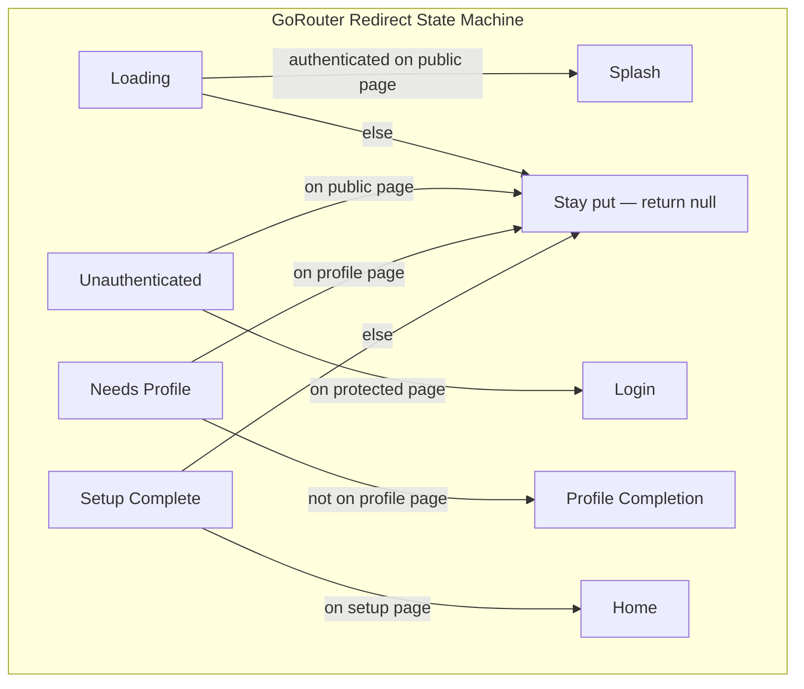

# Common Patterns

## Trigger

Signals: pagination, search debounce, form validation, GoRouter redirect, typed routes
Before generating code in this area, output verbatim: `Reading: common-patterns.md`


## Contents

- [Rules — NEVER Violate](#rules--never-violate)
- [Route-Param Safety + Wizard Sequencing](#route-param-safety--wizard-sequencing)
- [Pagination](#pagination)
- [Search with Debounce](#search-with-debounce)
- [Local Filter (No API Call)](#local-filter-no-api-call)
- [Form Validation](#form-validation)
- [Batch Processing](#batch-processing)
- [Pull-to-Refresh](#pull-to-refresh)
- [Navigation with Typed GoRouter](#navigation-with-typed-gorouter)
- [Long-Running Sync/Auth Cancellation](#long-running-syncauth-cancellation)
- [Delta Sync (Incremental Remote Pull)](#delta-sync-incremental-remote-pull)
- [Dismiss Modal → Push Route (Bottom Sheet Navigation)](#dismiss-modal--push-route-bottom-sheet-navigation)

## Rules — NEVER Violate

1. **MUST** use typed GoRouter routes (`const MyRoute().go(context)` / `const MyRoute().push<T>(context)`) — NEVER string-based `context.go('/path')` (lint: `router_string_nav`), `GoRouter.of(context).push|go|...` (lint: `router_gorouter_of`), or `Navigator.of(context).push(MaterialPageRoute(...))` (lint: `router_untyped_navigator_push`).
2. **NEVER** use `ref.watch()` inside GoRouter `redirect` — recreates router every state change.
3. **MUST** guard `if (!ref.mounted) return;` after EVERY `await` in notifiers (pagination, search, forms, sync).
4. **MUST** use `ref.listen()` + `refreshListenable` for GoRouter redirect triggers — NEVER `ref.watch()`.
5. **MUST** debounce search inputs (500ms min) — NEVER call API on every keystroke.
6. **During loading, stay put.** Return `null` from redirect — NEVER bounce to splash on web refresh.
7. **MUST** guard dismiss/back `context.pop()` with `context.canPop()` + typed fallback route for deep-link/resume safety.
8. **Route-id lookups in widget `build()` MUST be nullable.** Use by-id provider + fallback UI. Never throw in `build()`.
9. **Wizard/deep-link mutation order MUST be:** persist write → targeted parent sync → navigate.
10. **Repo mounted rule:** keep `context.mounted` in widget async flows. Never swap to `mounted` to silence lint; refactor flow instead.
11. **NEVER** wrap `runApp` in `runZonedGuarded` — legacy (Flutter 3.3+), misses platform-channel async errors. Use the three-hook pattern: `FlutterError.onError` + `PlatformDispatcher.instance.onError` + `Isolate.current.addErrorListener`. Any function calling `runApp(...)` (incl. wrappers like `runMainApp`, `bootstrap`) MUST wire all three. Lints: `avoid_run_zoned_guarded` (bans the call) + `require_main_error_hooks` (enforces presence). Escape hatch: `// flutter_skill_lints:configure_error_hooks_elsewhere` inside the body when hooks live in an extracted helper. See [crashlytics.md](crashlytics.md).



**Contents:** [Pagination](#pagination) | [Search with Debounce](#search-with-debounce) | [Local Filter](#local-filter-no-api-call) | [Form Validation](#form-validation) | [Batch Processing](#batch-processing) | [Pull-to-Refresh](#pull-to-refresh) | [Navigation with Typed GoRouter](#navigation-with-typed-gorouter) | [Delta Sync](#delta-sync-incremental-remote-pull)

## Route-Param Safety + Wizard Sequencing

Use nullable by-id providers. Keep mutation order strict before navigate.

```dart
// Family + keepAlive caches every key forever — memory leak. Use plain `@riverpod`
// so each per-id provider auto-disposes when no widget watches it.
@riverpod
Program? programById(Ref ref, String id) {
  final state = ref.watch(programsProvider);
  for (final p in state.items) {
    if (p.id == id) return p;
  }
  return null;
}

Future<void> onNext(BuildContext context, WidgetRef ref, String programId) async {
  final program = ref.read(programByIdProvider(programId));
  if (program == null) return; // disable CTA / show placeholder

  // ✅ DO — fixed sequence: persist → targeted sync → navigate.
  //    Reorder = UI flicker (stale parent) OR lost writes on dispose.
  final updatedParent = program.copyWith(/* ...edits... */);
  await ref.read(programRepositoryProvider).save(updatedParent);
  ref.read(programsProvider.notifier).upsertProgram(updatedParent);
  if (!context.mounted) return;
  _goNext(context);
}

void _goNext(BuildContext context) {
  const NextRoute().go(context);
}
```

## Pagination

```dart
@freezed
sealed class PaginatedState with _$PaginatedState {
  const factory PaginatedState({
    @Default([]) List<Product> items,
    @Default(false) bool isLoading,
    @Default(false) bool isLoadingMore,
    @Default(true) bool hasMore,
    @Default(0) int page,
  }) = _PaginatedState;
}

@Riverpod(keepAlive: true)
class PaginatedProductNotifier extends _$PaginatedProductNotifier {
  static const _pageSize = 20;

  @override
  PaginatedState build() {
    Future.microtask(() => _loadPage(0)); // Defer — see state-management.md
    return const PaginatedState(isLoading: true);
  }

  Future<void> _loadPage(int page) async {
    if (!ref.mounted) return;
    state = state.copyWith(isLoading: page == 0, isLoadingMore: page > 0);
    try {
      final items = await ref.read(productRepositoryProvider).fetchPage(page, _pageSize);
      if (!ref.mounted) return;
      state = state.copyWith(
        items: page == 0 ? items : [...state.items, ...items],
        page: page,
        hasMore: items.length >= _pageSize,
        isLoading: false,
        isLoadingMore: false,
      );
    } catch (e) {
      if (!ref.mounted) return;
      state = state.copyWith(isLoading: false, isLoadingMore: false);
    }
  }

  Future<void> loadMore() async {
    if (state.isLoadingMore || !state.hasMore) return;
    await _loadPage(state.page + 1);
  }

  Future<void> refresh() async => _loadPage(0);
}
```

Widget with scroll detection:

```dart
class PaginatedProductList extends ConsumerWidget {
  const PaginatedProductList({super.key});

  @override
  Widget build(BuildContext context, WidgetRef ref) {
    final items = ref.watch(
      paginatedProductProvider.select((s) => s.items),
    );
    final hasMore = ref.watch(
      paginatedProductProvider.select((s) => s.hasMore),
    );

    return NotificationListener<ScrollNotification>(
      onNotification: (scroll) {
        if (scroll.metrics.pixels >= scroll.metrics.maxScrollExtent - 200) {
          ref.read(paginatedProductProvider.notifier).loadMore();
        }
        return false;
      },
      child: ListView.builder(
        itemCount: items.length + (hasMore ? 1 : 0),
        itemBuilder: (context, index) {
          if (index >= items.length) {
            return const Center(child: CircularProgressIndicator());
          }
          return ProductCard(product: items[index]);
        },
      ),
    );
  }
}
```

## Search with Debounce

```dart
@freezed
sealed class SearchState with _$SearchState {
  const factory SearchState({
    @Default('') String query,
    @Default([]) List<Product> results,
    @Default(false) bool isSearching,
  }) = _SearchState;
}

// Uses Debouncer from core/utils/debouncer.dart
// See extensions-utilities.md for the Debouncer class
@Riverpod(keepAlive: true)
class SearchNotifier extends _$SearchNotifier {
  final _debouncer = Debouncer();

  @override
  SearchState build() {
    ref.onDispose(_debouncer.dispose);
    return const SearchState();
  }

  void search(String query) {
    state = state.copyWith(query: query, isSearching: query.isNotEmpty);

    if (query.isEmpty) {
      _debouncer.cancel();
      state = state.copyWith(results: [], isSearching: false);
      return;
    }

    _debouncer.call(() async {
      try {
        final results = await ref.read(productRepositoryProvider).search(query);
        if (!ref.mounted) return;
        state = state.copyWith(results: results, isSearching: false);
      } catch (e) {
        if (!ref.mounted) return;
        state = state.copyWith(isSearching: false);
      }
    });
  }
}
```

## Local Filter (No API Call)

Filter items in state, no refetch:

```dart
@freezed
sealed class FilterableState with _$FilterableState {
  const factory FilterableState({
    @Default([]) List<Product> allItems,
    @Default('') String searchQuery,
  }) = _FilterableState;

  const FilterableState._();

  List<Product> get displayItems => searchQuery.isEmpty
      ? allItems
      : allItems
          .where((item) =>
              item.name.toLowerCase().contains(searchQuery.toLowerCase()))
          .toList();
}

// Widget — use .select() on the computed getter
final items = ref.watch(
  filterableProvider.select((s) => s.displayItems),
);
```

## Form Validation

```dart
@freezed
sealed class ProductFormState with _$ProductFormState {
  const factory ProductFormState({
    @Default('') String name,
    @Default('') String description,
    @Default(0.0) double price,
    String? nameError,
    String? priceError,
    @Default(false) bool isSubmitting,
  }) = _ProductFormState;

  const ProductFormState._();

  bool get isValid =>
      nameError == null &&
      priceError == null &&
      name.isNotEmpty &&
      price > 0;
}

@Riverpod(keepAlive: true)
class ProductFormNotifier extends _$ProductFormNotifier {
  @override
  ProductFormState build() => const ProductFormState();

  void setName(String value) {
    String? error;
    if (value.isEmpty) error = 'Name required';
    if (value.length < 3) error = 'Name too short';
    state = state.copyWith(name: value, nameError: error);
  }

  void setPrice(String value) {
    final parsed = double.tryParse(value);
    String? error;
    if (parsed == null) error = 'Invalid number';
    if (parsed != null && parsed <= 0) error = 'Must be positive';
    state = state.copyWith(
      price: parsed ?? 0,
      priceError: error,
    );
  }

  Future<void> submit() async {
    if (!state.isValid || state.isSubmitting) return;

    state = state.copyWith(isSubmitting: true);
    try {
      await ref.read(productRepositoryProvider).create(
        Product(
          id: DateTime.now().millisecondsSinceEpoch.toString(),
          name: state.name,
          price: state.price,
        ),
      );
      if (!ref.mounted) return;
      // Reset or navigate
      state = const ProductFormState();
    } catch (e) {
      if (!ref.mounted) return;
      state = state.copyWith(isSubmitting: false);
    }
  }
}
```

## Batch Processing

Extract to `core/utils/batch_utils.dart` for cross-feature reuse:

```dart
/// Process items in parallel batches to avoid overwhelming the server.
Future<void> parallelBatch<T>({
  required List<T> items,
  required Future<void> Function(T) action,
  int batchSize = 50,
}) async {
  for (int i = 0; i < items.length; i += batchSize) {
    final end = (i + batchSize).clamp(0, items.length);
    final batch = items.sublist(i, end);
    await Future.wait(batch.map(action));
    await Future<void>.value(); // yield to event loop
  }
}

// Usage in repository
Future<void> updateAll(List<Product> products) async {
  await parallelBatch(
    items: products,
    action: (p) => _remote.update(p),
    batchSize: 50,
  );
}
```

## Pull-to-Refresh

```dart
class ProductListScreen extends ConsumerWidget {
  const ProductListScreen({super.key});

  @override
  Widget build(BuildContext context, WidgetRef ref) {
    final items = ref.watch(
      productProvider.select((s) => s.items),
    );

    return RefreshIndicator(
      onRefresh: () async {
        await ref.read(productProvider.notifier).refresh();
      },
      child: ListView.builder(
        itemCount: items.length,
        itemBuilder: (context, index) => ProductCard(product: items[index]),
      ),
    );
  }
}
```

## Navigation with Typed GoRouter

Use `go_router_builder` for type-safe routes.

### Setup

```yaml
# pubspec.yaml — see README.md Core Stack table for canonical versions
dependencies:
  go_router: <version>

dev_dependencies:
  build_runner: <version>
  go_router_builder: <version>
```

### Route Definitions

```dart
// core/navigation/routes.dart
part 'routes.g.dart';

@TypedGoRoute<HomeRoute>(
  path: '/',
  routes: [
    TypedGoRoute<ProductListRoute>(
      path: 'products',
      routes: [
        TypedGoRoute<ProductDetailRoute>(path: ':id'),
        TypedGoRoute<ProductCreateRoute>(path: 'new'),
      ],
    ),
  ],
)
class HomeRoute extends GoRouteData with $HomeRoute {
  const HomeRoute();

  @override
  Widget build(BuildContext context, GoRouterState state) =>
      const HomeScreen();
}

class ProductListRoute extends GoRouteData with $ProductListRoute {
  const ProductListRoute();

  @override
  Widget build(BuildContext context, GoRouterState state) =>
      const ProductListScreen();
}

class ProductDetailRoute extends GoRouteData with $ProductDetailRoute {
  const ProductDetailRoute({required this.id});
  final String id;

  @override
  Widget build(BuildContext context, GoRouterState state) =>
      ProductDetailScreen(productId: id);
}

class ProductCreateRoute extends GoRouteData with $ProductCreateRoute {
  const ProductCreateRoute();

  @override
  Widget build(BuildContext context, GoRouterState state) =>
      const ProductCreateScreen();
}

@TypedGoRoute<LoginRoute>(path: '/login')
class LoginRoute extends GoRouteData with $LoginRoute {
  const LoginRoute({this.from});
  final String? from;  // query parameter

  @override
  Widget build(BuildContext context, GoRouterState state) =>
      LoginScreen(from: from);
}
```

### Router Provider with Auth Redirect

Create GoRouter once. Use `ref.listen()` + `refreshListenable` to trigger redirect re-evaluation. NEVER `ref.watch()` in redirect — recreates router every state change, resets route stack.

Keep redirect decisions pure. The GoRouter closure should read providers, call a pure resolver, and return the result. Matrix-test the resolver.

**Redirect rules for apps with multi-step setup (profile completion, roles):**

- **During loading, MUST stay put.** Return `null` — NEVER bounce to splash. On web refresh, redirecting `/chat` → `/` → `/home` loses URL. One exception: authenticated users on login/signup redirect to splash.
- **Auth pages MUST navigate explicitly.** Add `ref.listen(authProvider)` in login/signup pages, navigate on auth success. `refreshListenable` timing unreliable; explicit nav guarantees transition.
- **OAuth MUST skip auth-level `isLoading`.** Use per-button loading (`isGoogleLoading`). Auth `isLoading` triggers premature splash redirect.
- **keepAlive providers survive hot reload.** Redirect closure changes need hot restart.

```dart
@Riverpod(keepAlive: true)
GoRouter router(Ref ref) {
  final refreshNotifier = ValueNotifier<Object?>(null);
  ref.listen(setupInfoProvider, (_, __) {
    refreshNotifier.value = Object();
  });
  ref.onDispose(refreshNotifier.dispose);

  return GoRouter(
    initialLocation: const SplashRoute().location,
    refreshListenable: refreshNotifier,
    routes: $appRoutes,
    redirect: (context, state) {
      final setupStatus = ref.read(setupInfoProvider).status;
      final location = state.matchedLocation;

      return resolveAppRedirect(location: location, setupStatus: setupStatus);
    },
  );
}
```

```dart
@visibleForTesting
String? resolveAppRedirect({
  required String location,
  required SetupStatus setupStatus,
}) {
  switch (setupStatus) {
    case SetupStatus.loading:
      return null; // Stay put — preserves URL on web refresh.
    case SetupStatus.unauthenticated:
      return _isPublicPage(location) ? null : const LoginRoute().location;
    case SetupStatus.needsProfileCompletion:
      return location == '/profile-completion' ? null : '/profile-completion';
    case SetupStatus.setupComplete:
      return _isSetupPage(location) ? const HomeRoute().location : null;
  }
}
```

Test the matrix: loading, signed out, signed in, setup incomplete, setup complete, stale deep links, update-required gates, and auth pages.

```dart
// Belt-and-suspenders: auth pages navigate directly on authentication.
class AppLoginPage extends ConsumerWidget {
  const AppLoginPage({super.key});

  @override
  Widget build(BuildContext context, WidgetRef ref) {
    ref.listen(authProvider, (prev, next) {
      if (next.isAuthenticated && !(prev?.isAuthenticated ?? false)) {
        const SplashRoute().go(context);
      }
    });
    return const LoginPageContent();
  }
}
```

## Long-Running Sync/Auth Cancellation

Guard with a generation token or cancellation signal before every state write or remote connection change.

```dart
class SyncCoordinator {
  int _generation = 0;
  String? _activeUserId;

  Future<void> syncFor(String userId) async {
    final generation = ++_generation;
    _activeUserId = userId;

    await pull();
    if (!_isActive(userId, generation)) return;

    await push();
    if (!_isActive(userId, generation)) return;

    markComplete();
  }

  void cancel() {
    _generation++;
    _activeUserId = null;
  }

  bool _isActive(String userId, int generation) =>
      _generation == generation && _activeUserId == userId;
}
```

### Type-Safe Navigation

```dart
// Navigate with compile-time checked parameters
const HomeRoute().go(context);
const ProductListRoute().go(context);
ProductDetailRoute(id: product.id).go(context);
const ProductCreateRoute().go(context);

// Push (adds to stack)
ProductDetailRoute(id: product.id).push(context);

// Push with return value
final result = await ProductDetailRoute(id: product.id).push<bool>(context);

// Safe pop with typed fallback (recommended for dismiss/back actions)
if (context.canPop()) {
  context.pop(result);
  return;
}
const ProductListRoute().go(context);

```

**Forbidden (lint enforced)** — every form below has a typed-route replacement above:

| Anti-pattern | Lint |
|---|---|
| `context.go('/products/${id}')` / any string path | `router_string_nav` |
| `GoRouter.of(context).push(...)` / `.go` / `.pushNamed` / `.replace` | `router_gorouter_of` |
| `Navigator.of(context).push(MaterialPageRoute(...))` / `CupertinoPageRoute` / `PageRouteBuilder` | `router_untyped_navigator_push` |

### StatefulShellRoute Tabs

Use `StatefulNavigationShell.goBranch()` for main tabs. Don't `push` a tab route.

```dart
class AppShellScaffold extends StatelessWidget {
  const AppShellScaffold({required this.navigationShell, super.key});

  final StatefulNavigationShell navigationShell;

  @override
  Widget build(BuildContext context) {
    return BottomNavigationBar(
      currentIndex: navigationShell.currentIndex,
      onTap: navigationShell.goBranch,
      items: const [...],
    );
  }
}
```

- Inside shell, use `StatefulNavigationShell.of(context).goBranch(index)`.
- In reusable sheets/overlays, pass callback from shell-owned caller, don't route in child.

**GoRouter 17.x — `ShellRoute` propagates to root observers.** Since 17.0.0
`ShellRoute`/`StatefulShellRoute` notify root `NavigatorObserver`s by default.
Most want this (analytics on shell push). Root `RouteObserver` should fire
**only** for top-level nav? Pass `notifyRootObserver: false` on `ShellRoute`.
- Use route-level `.go(context)` only to enter shell from outside, or to intentionally reset branch to known root.

```dart
BentoWorkoutSelectorSheet(
  onCreateWorkout: () {
    Navigator.of(sheetContext).pop();
    navigationShell.goBranch(1);
  },
)
```

Wrong for shell tabs:

```dart
const ExercisesRoute().push<void>(context); // stacks another route
const ExercisesRoute().go(context);         // bypasses branch-switch semantics
```

### main.dart

```dart
class MyApp extends ConsumerWidget {
  const MyApp({super.key});

  @override
  Widget build(BuildContext context, WidgetRef ref) {
    final router = ref.watch(routerProvider);
    return MaterialApp.router(routerConfig: router);
  }
}
```

---

## Delta Sync (Incremental Remote Pull)

Fetch only rows changed since last sync, not all data.

### Repository Interface Additions

```dart
abstract interface class IExerciseRepository {
  // ... existing CRUD ...

  /// Upserts changed items into local storage by ID.
  Future<void> mergeAll(List<Exercise> items);

  /// Removes locally-stored items whose IDs are no longer present remotely.
  Future<void> deleteByIds(Set<String> ids);
}
```

### mergeAll Implementation

```dart
@override
Future<void> mergeAll(List<Exercise> items) async {
  final current = await _local.getAll();
  final updated = [...current];

  for (final item in items) {
    final index = updated.indexWhere((e) => e.id == item.id);
    if (index >= 0) {
      updated[index] = item;
    } else {
      updated.add(item);
    }
  }

  await _local.saveAll(updated);
}
```

### deleteByIds Implementation

```dart
@override
Future<void> deleteByIds(Set<String> ids) async {
  final current = await _local.getAll();
  final filtered = current.where((e) => !ids.contains(e.id)).toList();
  await _local.saveAll(filtered);
}
```

### Sync Service Flow

```dart
// Per-table delta sync:
// 1. Read per-table lastSyncDate from settings
// 2. If null → full getAll + saveAll (backward compat, first delta)
// 3. If exists → getUpdatedSince(lastSyncDate) + mergeAll
// 4. getAllIds from remote, compare to local IDs, deleteByIds for missing
// 5. Store new per-table lastSyncDate

final lastTableSync = await settingsRepo.getTableSyncDate(tableKey);

if (lastTableSync == null) {
  final all = await remote.getAll(userId);
  if (all.isNotEmpty) await repo.saveAll(all.map((m) => m.toEntity()).toList());
} else {
  final changed = await remote.getUpdatedSince(userId, lastTableSync);
  if (changed.isNotEmpty) await repo.mergeAll(changed.map((m) => m.toEntity()).toList());

  final remoteIds = (await remote.getAllIds(userId)).toSet();
  final localIds = (await repo.getAll()).map((e) => e.id).toSet();
  final deleted = localIds.difference(remoteIds);
  if (deleted.isNotEmpty) await repo.deleteByIds(deleted);
}

await settingsRepo.setTableSyncDate(tableKey, DateTime.now().toUtc());
```

### Per-Table Sync Date Storage

```dart
// In settings repository:
static const exerciseSyncDateKey = 'sync_date_exercises';

Future<DateTime?> getTableSyncDate(String key) async {
  final ms = await _storage.read<int>(key);
  return ms != null ? DateTime.fromMillisecondsSinceEpoch(ms, isUtc: true) : null;
}

Future<void> setTableSyncDate(String key, DateTime date) async {
  await _storage.save(key, date.millisecondsSinceEpoch);
}
```

### When to Use

| Scenario | Approach |
|----------|----------|
| Data rarely changes | Delta sync — fetches nothing when no changes |
| Frequent small edits | Delta sync — fetches only changed rows |
| Full data refresh needed | Full pull with `saveAll` |

## Dismiss Modal → Push Route (Bottom Sheet Navigation)

**Problem.** Push while `showModalBottomSheet` animates out → sheet flickers or stays visible behind new screen (known Flutter issue).

**NEVER:**
```dart
context.pop();
await CreateExerciseRoute().push(context); // race — modal still animating
```

**DO — await pop future, then navigate:**
```dart
// Sheet widget:
void _onCreateTapped() {
  // maybePop() Future resolves AFTER dismiss animation completes.
  Navigator.of(context).maybePop().then((_) {
    if (context.mounted) widget.onCreateCallback();
  });
}

// Parent widget (outside sheet) — guaranteed post-dismiss:
Future<void> _onCreateCallback() async {
  final id = await CreateExerciseRoute().push<String>(context);
  if (id != null && context.mounted) _useId(id);
}
```

## Recap

1. MUST use typed GoRouter routes (`const MyRoute().go(context)` / `const MyRoute().push<T>(context)`) — NEVER string-based `context.go('/path')`, `GoRouter.of(context).push|go|...`, or `Navigator.of(context).push(MaterialPageRoute(...))`. Lints: `router_string_nav`, `router_gorouter_of`, `router_untyped_navigator_push`.
2. MUST guard `if (!ref.mounted) return;` after EVERY `await` in notifiers (pagination, search, forms, sync).
3. Route-id lookups in widget `build()` MUST be nullable — use a by-id provider + fallback UI. NEVER throw in `build()` for a missing route parameter.

