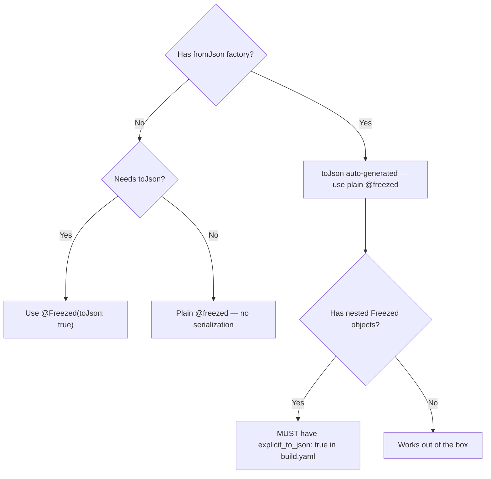

# Freezed 3.x Sealed Classes

All Freezed classes MUST use `sealed class` — NEVER `abstract class`.

## Trigger

Signals: Freezed, sealed class, @freezed, build.yaml, explicit_to_json, copyWith, union types
Before generating code in this area, output verbatim: `Reading: freezed-sealed.md`


## Contents

- [Rules — NEVER Violate](#rules--never-violate)
- [Setup](#setup)
- [Simple Data Classes](#simple-data-classes)
- [Adding Methods and Getters](#adding-methods-and-getters)
- [Union Types](#union-types)
- [AsyncValue Pattern Matching](#asyncvalue-pattern-matching)
- [Feature State](#feature-state)
- [Deep Copy](#deep-copy)
- [JSON Serialization](#json-serialization)
- [Non-Constant Default Values](#non-constant-default-values)
- [Inheritance](#inheritance)
- [Mutable Classes](#mutable-classes)
- [Configuration](#configuration)
- [Linting](#linting)
- [Rich Models](#rich-models)
- [Deep Serialization](#deep-serialization)

## Rules — NEVER Violate

1. **MUST** use `sealed class` with `@freezed` — NEVER `abstract class`.
2. **MUST** add `const Entity._()` private constructor when adding methods or getters.
3. **MUST** use `build.yaml` with `explicit_to_json: true` — NEVER per-class `@JsonSerializable(explicitToJson: true)`.
4. **MUST** use Dart native `switch` expressions — NEVER Freezed legacy `when`/`map` (removed in 3.0).
5. **NEVER** use `@Freezed(toJson: true)` when `fromJson` factory exists — Freezed auto-generates `toJson`.
6. **MUST** put `fromJson`/`toJson` ONLY on data models — NEVER on domain entities.
7. **MUST** put Rich Model methods deriving from own fields on model — NEVER in repository.



**Contents:** [Setup](#setup) | [Simple Data Classes](#simple-data-classes) | [Adding Methods and Getters](#adding-methods-and-getters) | [Union Types](#union-types) | [AsyncValue Pattern Matching](#asyncvalue-pattern-matching) | [Feature State](#feature-state) | [Deep Copy](#deep-copy) | [JSON Serialization](#json-serialization) | [Non-Constant Default Values](#non-constant-default-values) | [Inheritance](#inheritance) | [Mutable Classes](#mutable-classes) | [Configuration](#configuration) | [Linting](#linting) | [Rich Models](#rich-models) | [Deep Serialization](#deep-serialization)

## Setup

```yaml
# pubspec.yaml — see README.md Core Stack table for canonical versions
environment:
  sdk: '>=3.8.0 <4.0.0'   # freezed requires Dart >= 3.8

dependencies:
  freezed_annotation: <version>
  json_annotation: <version>

dev_dependencies:
  build_runner: <version>
  freezed: <version>
  json_serializable: <version>
```

Pin `json_serializable` to `6.13.0`. `6.13.1+` needs analyzer `>=10`. Riverpod + Hive CE generator stack resolves on analyzer 9. **Re-check pin** after Riverpod/Hive CE generator upgrade. Both compat w/ analyzer 10 → lift to `^6.13.x`. Run `dart pub deps -s compact | rg analyzer` first.

Every file need:

```dart
import 'package:freezed_annotation/freezed_annotation.dart';

part 'my_file.freezed.dart';
part 'my_file.g.dart';  // only if using fromJson/toJson
```

## Simple Data Classes

Single constructor with `sealed class`:

```dart
@freezed
sealed class Product with _$Product {
  const factory Product({
    required String id,
    required String name,
    required double price,
    @Default(0) int quantity,
    @Default(true) bool isActive,
  }) = _Product;

  factory Product.fromJson(Map<String, dynamic> json) =>
      _$ProductFromJson(json);
}
```

Generated: `copyWith`, `toString`, `==`, `hashCode`, `toJson`.

## Adding Methods and Getters

Add private constructor first:

```dart
@freezed
sealed class Product with _$Product {
  const Product._();

  const factory Product({
    required String id,
    required String name,
    required double price,
    @Default(0) int quantity,
  }) = _Product;

  factory Product.fromJson(Map<String, dynamic> json) =>
      _$ProductFromJson(json);

  double get totalValue => price * quantity;
  bool get inStock => quantity > 0;
}
```

## Union Types

Multiple constructors create tagged unions with exhaustive matching:

```dart
@freezed
sealed class AuthState with _$AuthState {
  const factory AuthState.authenticated(User user) = Authenticated;
  const factory AuthState.unauthenticated() = Unauthenticated;
  const factory AuthState.loading() = AuthLoading;
}

// Exhaustive switch — compiler enforces all cases
Widget build(BuildContext context, WidgetRef ref) {
  final auth = ref.watch(authProvider);
  return switch (auth) {
    Authenticated(:final user) => HomeScreen(user: user),
    Unauthenticated() => const LoginScreen(),
    AuthLoading() => const LoadingScreen(),
  };
}
```

Use Dart native `switch` expressions. NEVER use Freezed legacy `when`/`map` (removed in Freezed 3.0).

## AsyncValue Pattern Matching

Riverpod `AsyncValue` also sealed:

```dart
final asyncData = ref.watch(myAsyncProvider);
return switch (asyncData) {
  AsyncData(:final value) => Text(value.toString()),
  AsyncError(:final error) => Text('Error: $error'),
  AsyncLoading() => const ShimmerPlaceholder(), // Prefer skeleton/shimmer over bare CircularProgressIndicator
};
```

`AsyncLoading(progress: 0.5)` report loading progress. `AsyncValue.isFromCache` flag offline-persisted data.

## Feature State

Combine state class with union for multi-state features:

```dart
@freezed
sealed class ProductState with _$ProductState {
  const factory ProductState({
    @Default([]) List<Product> items,
    @Default(false) bool isLoading,
    @Default(false) bool isLoadingMore,
    @Default(false) bool hasMore,
    @Default(0) int page,
    AppError? error,
    String? searchQuery,
  }) = _ProductState;
}
```

Use `copyWith` to update fields:

```dart
state = state.copyWith(isLoading: true);
state = state.copyWith(items: newItems, isLoading: false);
state = state.copyWith(error: null); // clear error
```

## Deep Copy

When Freezed classes nest other Freezed classes, use deep copy:

```dart
@freezed
sealed class Company with _$Company {
  const factory Company({
    String? name,
    required Director director,
  }) = _Company;
}

@freezed
sealed class Director with _$Director {
  const factory Director({
    String? name,
    Assistant? assistant,
  }) = _Director;
}

// Deep copy syntax
Company newCompany = company.copyWith.director.assistant(name: 'John Smith');

// Null-safe deep copy
Company? newCompany = company.copyWith.director.assistant?.call(name: 'John');
```

## JSON Serialization

### Single Constructor

```dart
@freezed
sealed class UserModel with _$UserModel {
  const factory UserModel({
    required String id,
    @JsonKey(name: 'full_name') required String fullName,
    @JsonKey(name: 'created_at') required DateTime createdAt,
  }) = _UserModel;

  factory UserModel.fromJson(Map<String, dynamic> json) =>
      _$UserModelFromJson(json);
}
```

### Union Type Serialization

Uses `runtimeType` discriminator by default:

```dart
@freezed
sealed class ApiResponse with _$ApiResponse {
  const factory ApiResponse.success(Object? data) = ApiSuccess;
  const factory ApiResponse.error(String message) = ApiError;

  factory ApiResponse.fromJson(Map<String, dynamic> json) =>
      _$ApiResponseFromJson(json);
}
```

Customize discriminator key:

```dart
@Freezed(unionKey: 'type', unionValueCase: FreezedUnionCase.pascal)
sealed class ApiResponse with _$ApiResponse {
  const factory ApiResponse.success(Object? data) = ApiSuccess;

  @FreezedUnionValue('ServerError')
  const factory ApiResponse.error(String message) = ApiError;

  factory ApiResponse.fromJson(Map<String, dynamic> json) =>
      _$ApiResponseFromJson(json);
}
```

### Generic Serialization

```dart
@Freezed(genericArgumentFactories: true)
sealed class Paginated<T> with _$Paginated<T> {
  const factory Paginated({
    required List<T> items,
    required int total,
    required int page,
  }) = _Paginated;

  factory Paginated.fromJson(
    Map<String, dynamic> json,
    T Function(Object?) fromJsonT,
  ) => _$PaginatedFromJson(json, fromJsonT);
}
```

## Non-Constant Default Values

Use private constructor:

```dart
@freezed
sealed class Event with _$Event {
  Event._({DateTime? createdAt}) : createdAt = createdAt ?? DateTime.now();

  factory Event({required String title, DateTime? createdAt}) = _Event;

  @override
  final DateTime createdAt;
}
```

## Inheritance

```dart
class BaseEntity {
  const BaseEntity(this.id);
  final String id;
}

@freezed
sealed class Product extends BaseEntity with _$Product {
  const Product._(super.id) : super();
  const factory Product(String id, String name) = _Product;
}
```

## Mutable Classes

Use `@unfreezed` for mutable state (rare — prefer immutable):

```dart
@unfreezed
sealed class FormData with _$FormData {
  factory FormData({
    required String name,
    required String email,
    required final int id, // final = still immutable
  }) = _FormData;
}
```

## Configuration

Per-class:

```dart
@Freezed(copyWith: false, equal: false, toStringOverride: false)
sealed class Minimal with _$Minimal {
  const factory Minimal(int value) = _Minimal;
}
```

Project-wide via `build.yaml`:

```yaml
targets:
  $default:
    builders:
      freezed:
        options:
          format: false          # faster builds
          copy_with: true
          equal: true
          union_key: type
          union_value_case: pascal
```

## Linting

Use the canonical analyzer config from [analysis_options.yaml](analysis_options.yaml). It already sets `invalid_annotation_target: ignore` for Freezed and enables the Dart analyzer plugin system used by this skill.

## Rich Models

**Rule: If method reads only own fields, MUST belong on model.**

MUST add `const Entity._()` to enable getters and methods on Freezed classes:

```dart
@freezed
sealed class Order with _$Order {
  const Order._();

  const factory Order({
    required String id,
    required List<OrderItem> items,
    required DateTime createdAt,
  }) = _Order;

  double get total => items.fold(0, (sum, i) => sum + i.price * i.quantity);
  List<String> get productIds => items.map((i) => i.productId).toList();
  OrderSummary toSummary() => OrderSummary(id: id, itemCount: items.length, total: total);
}
```

| Belongs on model | Goes elsewhere |
|-----------------|---------------|
| Computed getters (`total`, `isExpired`) | Needs external deps (API, DB) → Repository |
| Boolean checks (`inStock`, `isOverdue`) | Reads multiple unrelated models → Repository |
| Collection flattening (`allResults`) | Needs Ref/providers → Notifier |
| Transform to another type (`toClaims()`) | Side effects (HTTP, I/O) → Datasource |
| Format for API (`toFormFields()`) | |

Data models follow same rule: `toEntity()`, `toRequestBody()`, `toCsvRow()` all belong on model.

## Deep Serialization

Freezed not deep-serialize nested objects by default. Without explicit config, nested Freezed objects serialize as `Instance of '_XYZ'` instead of JSON maps — cause `type '_XYZ' is not a subtype of Map<String, dynamic>` crashes in release builds.

### Why build.yaml Is Required

Generated `toJson()` does NOT call `.toJson()` on nested objects unless `explicit_to_json` enabled. `@Freezed(toJson: true)` does NOT enable deep serialization — redundant when `fromJson` exists.

### Global Fix: build.yaml

Set `explicit_to_json: true` once in `build.yaml`. All nested objects serialize correctly project-wide:

```yaml
# build.yaml (project root)
targets:
  $default:
    builders:
      json_serializable:
        options:
          explicit_to_json: true
```

### Quick Reference

| Setting | What it does | When needed |
|---|---|---|
| `@freezed` + `fromJson` factory | Generates both `fromJson` and `toJson` | Always — standard Freezed pattern |
| `build.yaml explicit_to_json` | Calls `.toJson()` on nested objects | Always — set once, forget |
| `@Freezed(toJson: true)` | Forces `toJson` generation | Only if class has NO `fromJson` factory (rare) |
| `@JsonSerializable(explicitToJson: true)` | Per-class deep serialization (legacy) | NEVER — build.yaml replaces it |

## Recap

1. MUST use `sealed class` with `@freezed` — NEVER `abstract class`. Required by Freezed 3.x.
2. MUST configure `build.yaml` with `explicit_to_json: true` — NEVER use per-class `@JsonSerializable(explicitToJson: true)`.
3. MUST use Dart native `switch` expressions for union matching — NEVER Freezed legacy `.when()`/`.map()` (removed in Freezed 3.0). Native switch is exhaustive and does not require default cases on sealed types.

