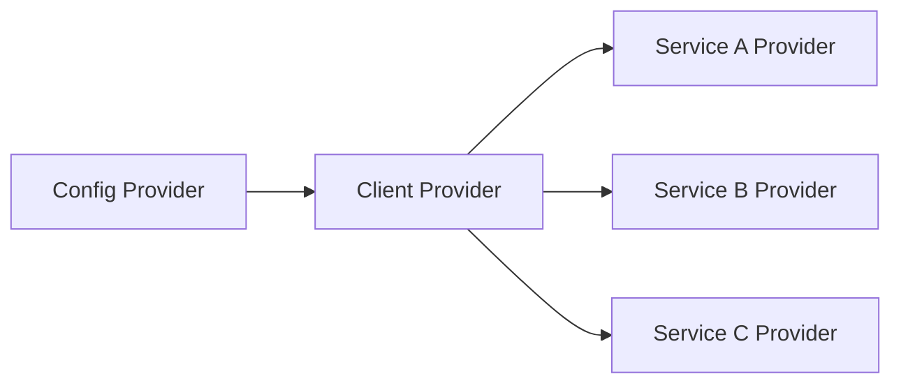
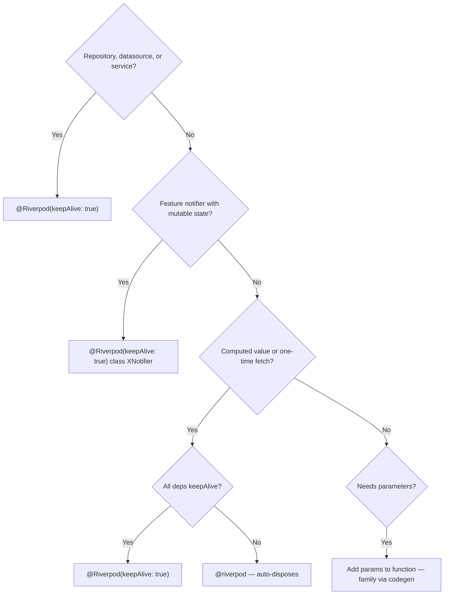

# Riverpod 3.x Codegen

## Trigger

Signals: @riverpod, @Riverpod(keepAlive), Notifier, AsyncNotifier, riverpod_annotation, riverpod_generator
Before generating code in this area, output verbatim: `Reading: riverpod-codegen.md`


## Contents

- [Setup](#setup)
- [Generated Provider Names](#generated-provider-names)
- [Provider Types](#provider-types)
- [Unified Ref](#unified-ref)
- [Automatic Retry](#automatic-retry)
- [ProviderException](#providerexception)
- [Mutations (experimental)](#mutations-experimental)
- [Offline Persistence (experimental)](#offline-persistence-experimental)
- [Pause/Resume](#pauseresume)
- [Weak Listeners](#weak-listeners)
- [Lifecycle Listeners Return Unsubscribe Functions](#lifecycle-listeners-return-unsubscribe-functions)
- [Scoping (codegen only)](#scoping-codegen-only)
- [Backend Client Providers](#backend-client-providers)

Generate all providers with annotations. Never write providers manually. Never import from `package:riverpod/legacy.dart`.

Hard rule: this applies to every provider shape: state, computed value, repository, datasource, service/client, family, future, stream, and notifier. Manual `Provider(...)`, `FutureProvider(...)`, `StreamProvider(...)`, `StateProvider(...)`, `NotifierProvider(...)`, `AsyncNotifierProvider(...)`, `StateNotifierProvider(...)`, and `ChangeNotifierProvider(...)` are banned.

## Setup

```yaml
# pubspec.yaml — see README.md Core Stack table for canonical versions
dependencies:
  flutter_riverpod: <version>
  riverpod_annotation: <version>

dev_dependencies:
  build_runner: <version>
  riverpod_generator: <version>
```

> **Forward note.** Riverpod 3.x changelog: *"4.0.0 quite possible."* Treat
> 3.x as short-lived. Prefer codegen + `Notifier` shapes over deprecated
> APIs — minimise 4.0 migration.

Canonical [analysis_options.yaml](analysis_options.yaml): `flutter_skill_lints` + `riverpod_lint`. Apply [analysis-options.md](analysis-options.md#install) before `dart analyze` (use `dart analyze`, not `flutter analyze` — see [analysis-options.md](analysis-options.md#rule--use-dart-analyze-not-flutter-analyze)).

Every file with providers need these:

```dart
import 'package:flutter_riverpod/flutter_riverpod.dart';
import 'package:riverpod_annotation/riverpod_annotation.dart';

part 'my_file.g.dart';
```

## Generated Provider Names

Riverpod 3.x strip "Notifier" suffix from class-based provider names:

| Class | Generated Provider |
|---|---|
| `CartNotifier` | `cartProvider` |
| `ProductNotifier` | `productProvider` |
| `AuthNotifier` | `authProvider` |

Functional providers keep full name:
| Function | Generated Provider |
|---|---|
| `productRepository(Ref)` | `productRepositoryProvider` |
| `cartTotal(Ref)` | `cartTotalProvider` |

Never write `xxxNotifierProvider` — not exist in codegen output.

Never create an alias/manual provider to "simplify" a generated provider. Rename the annotated function/class instead, regenerate `.g.dart`, and update call sites.

## Provider Types

### keepAlive Providers (long-lived)

For repositories, datasources, services, feature notifiers:

```dart
// Functional provider — returns a value, lives forever
@Riverpod(keepAlive: true)
ProductRepository productRepository(Ref ref) {
  return ProductRepository(
    ref.read(productRemoteDatasourceProvider),
    ref.read(productLocalDatasourceProvider),
  );
}

// Class-based notifier — manages mutable state, lives forever
@Riverpod(keepAlive: true)
class CartNotifier extends _$CartNotifier {
  @override
  CartState build() => const CartState();

  void addItem(Product product) {
    state = state.copyWith(
      items: [...state.items, product],
    );
  }
}
```

### Auto-dispose Providers (short-lived)

For computed values, one-time fetches, derived state:

```dart
// Computed value — disposes when no widget watches it
@riverpod
int cartTotal(Ref ref) {
  final items = ref.watch(cartProvider.select((s) => s.items));
  return items.fold(0, (sum, item) => sum + item.price.toInt());
}

// Async fetch — disposes when unused
@riverpod
Future<ProductDetail> productDetail(Ref ref, String id) async {
  final repo = ref.read(productRepositoryProvider);
  return repo.fetchById(id);
}
```

### Family Providers (parameterized)

Codegen handle family automatically via function parameters:

```dart
// Parameters become family args — no FamilyNotifier needed
@riverpod
Future<List<Product>> productsByCategory(Ref ref, String category) async {
  final repo = ref.read(productRepositoryProvider);
  return repo.fetchByCategory(category);
}

// Class-based with parameters
@riverpod
class ProductEditor extends _$ProductEditor {
  @override
  ProductFormState build(String productId) {
    Future.microtask(() => _loadProduct(productId));
    return const ProductFormState();
  }

  Future<void> _loadProduct(String id) async {
    final product = await ref.read(productRepositoryProvider).fetchById(id);
    if (!ref.mounted) return;
    state = state.copyWith(name: product.name, price: product.price);
  }
}
```

### Generic Providers (type parameters)

Generated providers support generics:

```dart
@riverpod
T multiply<T extends num>(Ref ref, T a, T b) {
  return a * b;
}

// Usage
int integer = ref.watch(multiplyProvider<int>(2, 3));
double decimal = ref.watch(multiplyProvider<double>(2.5, 3.5));
```

## Unified Ref

Use single `Ref` type. `AutoDisposeRef`, `FutureProviderRef`, generated `ExampleRef` removed:

```dart
// Riverpod 3.0 — always use Ref
@riverpod
String greeting(Ref ref) => 'Hello';

// NOT: String greeting(GreetingRef ref) — removed in 3.0
```

`Ref` and `WidgetRef` stay separate. `WidgetRef` for widgets only.

## Automatic Retry

Providers that fail during init retry automatically with exponential backoff (200ms initial, double up to 6.4s).

Customize globally:

```dart
void main() {
  runApp(
    ProviderScope(
      retry: (retryCount, error) {
        if (error is ProviderException) return null; // Don't retry dependency failures
        if (retryCount > 5) return null;             // Stop after 5 retries
        return Duration(seconds: retryCount * 2);
      },
      child: const MyApp(),
    ),
  );
}
```

Customize per provider:

```dart
@Riverpod(keepAlive: true, retry: myRetryLogic)
Future<Config> appConfig(Ref ref) async {
  return await fetchConfig();
}
```

## ProviderException

Provider errors wrap in `ProviderException`. Distinguishes "provider failed" from "dependency of provider failed":

```dart
try {
  ref.watch(failingProvider);
} on ProviderException catch (e) {
  switch (e.exception) {
    case NetworkError():
      // Handle network error
    default:
      rethrow;
  }
}
```

## Mutations (experimental)

> API may change without major version bump.

Mutations track side-effect state (idle, pending, success, error) separately from provider state. Prevent providers from being disposed while side-effect runs.

```dart
// features/todos/presentation/widgets/add_todo_button.dart
//
// Mutations = **file scope** (top-level), not inside class. Same instance
// shared across rebuilds + consumers. Matches Riverpod docs: one mutation =
// one file-scope `final`, named `<verb><Noun>Mutation`.
import 'package:flutter/material.dart';
import 'package:flutter_riverpod/flutter_riverpod.dart';

final addTodoMutation = Mutation<void>(); // experimental API — may change without major bump

class AddTodoButton extends ConsumerWidget {
  const AddTodoButton({super.key});
  @override
  Widget build(BuildContext context, WidgetRef ref) {
    final addTodo = ref.watch(addTodoMutation);

    return switch (addTodo) {
      MutationIdle() => ElevatedButton(
          onPressed: () {
            addTodoMutation.run(ref, (tsx) async {
              // tsx.get keeps the provider alive until mutation completes
              await tsx.get(todoListProvider.notifier).addTodo('New Todo');
            });
          },
          child: const Text('Submit'),
        ),
      MutationPending() => const CircularProgressIndicator(),
      MutationError() => ElevatedButton(
          onPressed: () { /* retry */ },
          child: const Text('Retry'),
        ),
      MutationSuccess() => const Text('Done'),
    };
  }
}
```

Use `tsx.get` instead of `ref.read` inside mutations — keeps provider alive until mutation completes.

`MutationState` exposes convenience flags (`isPending`, `isIdle`, `hasError`, `isSuccess`) for simple checks without full pattern matching.

## Offline Persistence (preview — not yet on pub.dev)

> `persist(...)` API + `riverpod_sqflite` = **preview only**. No stable
> release on pub.dev as of 2026-05-08. Do **not** add `riverpod_sqflite` to
> `pubspec.yaml` until shipped. For local persistence today: Hive CE
> ([hive-persistence.md](hive-persistence.md)). Snippet below = API preview,
> not copy-paste.

Providers will (eventually) persist via official `riverpod_sqflite` once published:

```dart
@Riverpod(keepAlive: true)
class TodosNotifier extends _$TodosNotifier {
  @override
  Future<List<Todo>> build() async {
    persist(
      ref.watch(storageProvider.future),
      key: 'todos',
      encode: jsonEncode,
      decode: (json) {
        final decoded = jsonDecode(json) as List<Object?>;
        return decoded.map((item) => Todo.fromJson(item as Map<String, dynamic>)).toList();
      },
    );

    return await fetchTodos();
  }
}
```

During `await`, persisted value shown. After network response, server state take precedence.

### Persistence Addendum

Keep all points below when using persistence:

Execution order:
1. Choose persistence owner (repo/data or notifier).
2. Define key + cache policy.
3. Choose startup mode (`persist(...)` or `await persist(...).future`).
4. Add in-memory persistence tests.

1. **One owner per feature state**: use repository/data persistence or notifier persistence, never both.
2. **Cache policy**: default retention 2 days; set `StorageOptions(cacheTime: ...)` when needed; use `unsafe_forever` only with cleanup.
3. **Persist keys**: keys must be unique, stable across restarts, include family params.
4. **Schema migration**: use `StorageOptions(destroyKey: ...)` for simple versioned resets.
5. **Startup mode**: use `persist(...)` for network-first init, or `await persist(...).future` to hydrate state first.
6. **UI signal**: use `AsyncValue.isFromCache` for cached/offline indicators.
7. **Tests**: override storage with `Storage.inMemory()` in unit/widget tests.
8. **Codegen**: use `@JsonPersist()` when JSON-serializable models available.

## Pause/Resume

Riverpod 3.0 pause providers when listeners not visible:

- Widgets off-screen (based on `TickerMode`) pause their providers
- If provider only used by paused providers, it pauses too
- When provider rebuilds, previous subscriptions stay until rebuild completes

Composition rule for pause-sensitive flows:
- Avoid nested computed chains (computed watches computed, especially family).
- Prefer one computed provider: watch base state directly, derive via pure helpers.
- If Riverpod 3.2.x pause/resume assertion appears in offstage navigation: flatten hops first, lifecycle workaround later.

Override pause behavior:

```dart
TickerMode(
  enabled: false, // pause listeners
  child: Consumer(
    builder: (context, ref, child) {
      final value = ref.watch(myProvider); // paused
      return Text(value.toString());
    },
  ),
)
```

## Weak Listeners

Listen without preventing auto-dispose:

```dart
ref.listen(
  anotherProvider,
  weak: true,
  (previous, next) {
    // Provider can still dispose even though we're listening
  },
);
```

## Lifecycle Listeners Return Unsubscribe Functions

```dart
final removeListener = ref.onDispose(() => print('disposed'));
// Call to remove:
removeListener();
```

## Scoping (codegen only)

Scoped providers declare `dependencies: []` and require override before use:

```dart
@Riverpod(dependencies: [])
Future<int> scopedValue(Ref ref) => throw UnimplementedError();

// Must override before use
ProviderScope(
  overrides: [
    scopedValueProvider.overrideWithValue(const AsyncValue.data(42)),
  ],
  child: const MyWidget(),
)
```

Use `@Dependencies([scopedValue])` on widgets consuming scoped providers. Lint rule catches missing overrides at compile time.

## Backend Client Providers

External SDK clients (HTTP, database, auth, storage) follow **config → client → services** chain. Riverpod providers ARE dependency injection — no factory classes, service locators, or wrapper layers needed.

### Rules — NEVER Violate

1. **MUST** expose SDK types directly as providers. NEVER wrap in factory class or service locator.
2. **MUST** use `@Riverpod(keepAlive: true)` for all SDK client and service providers — they singletons.
3. **MUST** chain providers with `ref.watch()` so services react to config changes.
4. **MUST** use destructuring for clean config access.
5. **NEVER** create `ServiceFactory`, `ServiceLocator`, or `BackendProvider` class — Riverpod providers replace these patterns entirely.

### Provider Chain



### Pattern

```dart
// core/providers/backend_providers.dart

/// 1. Config — reads from environment, lives forever
@Riverpod(keepAlive: true)
BackendConfig backendConfig(Ref ref) {
  return BackendConfig.fromEnvironment();
}

/// 2. Client — depends on config, configured once
@Riverpod(keepAlive: true)
HttpClient backendClient(Ref ref) {
  final BackendConfig(:endpoint, :apiKey) = ref.watch(backendConfigProvider);
  return HttpClient()
    ..setEndpoint(endpoint)
    ..setApiKey(apiKey);
}

/// 3. Services — each depends on client, one provider per SDK service
@Riverpod(keepAlive: true)
AuthService authService(Ref ref) {
  return AuthService(ref.watch(backendClientProvider));
}

@Riverpod(keepAlive: true)
DatabaseService databaseService(Ref ref) {
  return DatabaseService(ref.watch(backendClientProvider));
}

@Riverpod(keepAlive: true)
StorageService storageService(Ref ref) {
  return StorageService(ref.watch(backendClientProvider));
}
```

## Provider Decision Tree



**Family + keepAlive caveat.** Family + `@Riverpod(keepAlive: true)` keeps every arg variant forever. Cache can grow unbounded. Prefer `@riverpod` for family providers.

**Nested computed hop warning.** Avoid computed → computed chains in pause-sensitive paths (`aProvider` watches `bProvider(param)`). Riverpod 3.2.x offstage navigation can throw a `TickerMode` pause/resume assertion.

If a chain is required, flatten in the parent provider:
- watch base state directly
- derive via pure helpers
- avoid provider → provider indirection on hot navigation paths

**Exception:** Riverpod 3.2.x has a TickerMode assertion bug ([rrousselGit/riverpod#4709](https://github.com/rrousselGit/riverpod/issues/4709)). If you hit it, a `keepAlive: true` workaround is allowed. Add an inline note: `// keepAlive: Riverpod 3.2.x #4709 workaround`. Remove the workaround after the upstream fix.

## Recap

1. NEVER write providers manually — ALL provider shapes (state, computed, repo, datasource, notifier, family, future, stream) MUST use `@riverpod` or `@Riverpod(keepAlive: true)` annotations and be generated by `riverpod_generator`.
2. NEVER import from `package:riverpod/legacy.dart` — legacy providers (`StateProvider`, `StateNotifierProvider`, `ChangeNotifierProvider`) are banned even when imported indirectly.
3. NEVER create an alias or manual provider to simplify a generated name — rename the annotated class or function and regenerate. The generated name is the source of truth.

