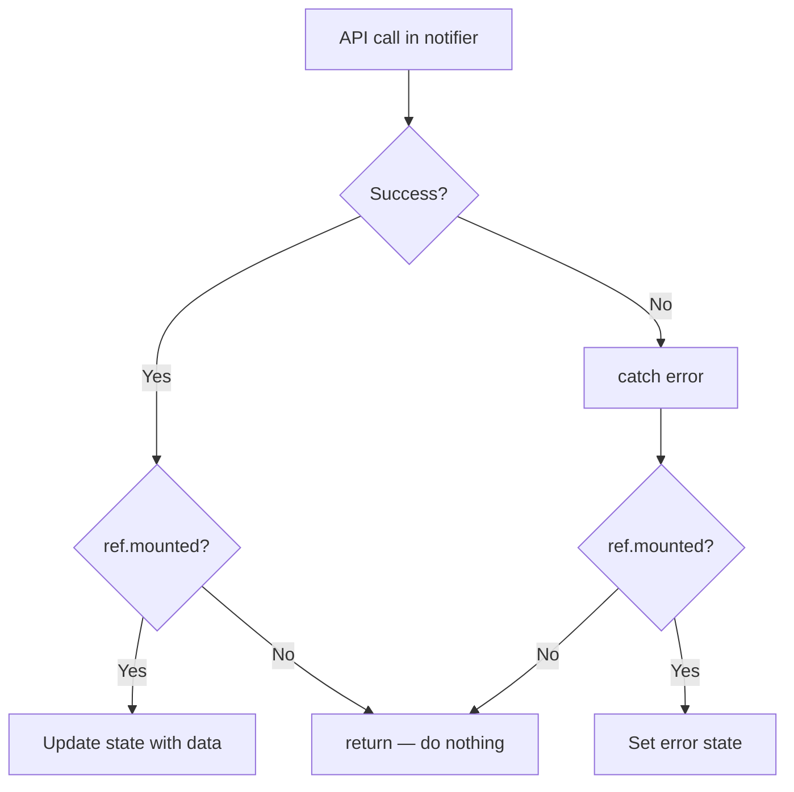

# State Management

## Trigger

Signals: ref.mounted, Notifier, AsyncNotifier, state.copyWith, ref.onDispose, sync notifier trap
Before generating code in this area, output verbatim: `Reading: state-management.md`


## Contents

- [Notifier Structure](#notifier-structure)
- [Sync Notifier Initialization Trap](#sync-notifier-initialization-trap)
- [ref.mounted Guard](#refmounted-guard)
- [Dependency Readiness For Mutations](#dependency-readiness-for-mutations)
- [Optimistic Updates](#optimistic-updates)
- [Preventing Duplicate Fetches](#preventing-duplicate-fetches)
- [Async Initialization](#async-initialization)
- [AsyncNotifier Pattern](#asyncnotifier-pattern)
- [AsyncValue.requireValue](#asyncvaluerequirevalue)
- [Loading Progress](#loading-progress)
- [Cleanup](#cleanup)
- [Error Handling Strategy](#error-handling-strategy)
- [Domain Error Types](#domain-error-types)
- [Cross-Provider Communication](#cross-provider-communication)

## Rules — NEVER Violate

0. **NEVER prop-drill state.** Child widgets watch the provider directly via `ref.watch` / `ref.read` / `ref.listen`. Do **not** pass entity / state / notifier instances through constructor parameters. Allowed constructor params: `Key`, callbacks (`VoidCallback`, `ValueChanged`, etc.), primitive props on atoms, and immutable IDs for lookup. `class OrderCard extends StatelessWidget { final OrderEntity order; ... }` — forbidden. `class OrderCard extends ConsumerWidget { final String orderId; ... build → ref.watch(orderProvider(orderId)) }` — correct.

0b. **NEVER call storage SDK from a notifier or widget.** `Hive.openBox`, `Hive.box`, `box.get`/`put`/`delete`, `SharedPreferences.getInstance`, `FlutterSecureStorage()`, `getApplicationDocumentsDirectory()`, `dart:io` file ops — all live behind a `Local<X>Datasource` interface, called by `<X>Repository`. Notifier depends on the repository provider, not on storage. Imports of `package:hive_ce`, `package:hive_ce_flutter`, `package:shared_preferences`, `package:flutter_secure_storage`, `package:path_provider`, or `dart:io` in `*_notifier.dart` or any `presentation/` file are violations.

0c. **MUST extract shared behavior to a mixin.** When the same logic appears in 2+ notifiers, widgets, or services, write `mixin XxxMixin on Y` and apply via `with`. Suffix the name with `Mixin`. Copy-paste sharing across notifiers / widgets / services is forbidden. See [mixins.md](mixins.md).

1. **MUST** check `if (!ref.mounted) return;` after EVERY `await` in notifier.
2. **MUST** check `if (!context.mounted) return;` after EVERY `await` in widget.
3. **MUST** catch error in notifier by default. Datasource, repo propagate. `try/catch` at data layer allowed **only** for: (a) domain error translation, (b) idempotency recovery (404/409), (c) transaction rollback, (d) local-first fire-and-forget sync. Plain log-and-rethrow forbidden — delete.
4. **MUST** `ref.read()` one-time access in callback. MUST `ref.watch()` rebuild on dep change.
5. **MUST** dispose timer, controller, subscription via `ref.onDispose()`.
6. **NEVER** `ref.watch()` inside notifier method — use `ref.read()` or `ref.listen()`.
7. **NEVER** set state after mounted check fail — return now.
8. **NEVER** read `state` (incl `state.copyWith`) inside sync `Notifier.build()` or any path sync before `build()` returns. First `state` assign in sync notifier must be direct value (e.g. `state = const FooState(isLoading: true)`), or deferred via `Future.microtask`. Read state before first `state=` throw *"Tried to read the state of an uninitialized provider"*. `AsyncNotifier` exempt (pre-init `AsyncLoading`). See [Sync Notifier Initialization Trap](#sync-notifier-initialization-trap).
9. **MUST** init repo/dep inside mutation method before write (`create*`, `update*`, `delete*`, `set*`, `reorder*`). Never rely on background `_init*()` timing.
10. **MUST** avoid broad parent-provider invalidation in nav-critical flow (wizard/deep-link route param). Use targeted sync (`upsert`/replace/remove).
11. **NEVER** swap `context.mounted` to `mounted` to suppress lint. Style = `context.mounted`. In `State` methods, use `final context = this.context;` before `await`, then `if (!context.mounted) return;`.



**Contents:** [Notifier Structure](#notifier-structure) | [Sync Notifier Initialization Trap](#sync-notifier-initialization-trap) | [ref.mounted Guard](#refmounted-guard) | [Dependency Readiness For Mutations](#dependency-readiness-for-mutations) | [Optimistic Updates](#optimistic-updates) | [Preventing Duplicate Fetches](#preventing-duplicate-fetches) | [Async Initialization](#async-initialization) | [AsyncNotifier Pattern](#asyncnotifier-pattern) | [AsyncValue.requireValue](#asyncvaluerequirevalue) | [Loading Progress](#loading-progress) | [Cleanup](#cleanup) | [Error Handling Strategy](#error-handling-strategy) | [Domain Error Types](#domain-error-types) | [Cross-Provider Communication](#cross-provider-communication)

## Widget Context After Await

Widgets guard the `BuildContext`, not just `State.mounted`.

```dart
class ProductPageState extends ConsumerState<ProductPage> {
  Future<void> save() async {
    final context = this.context;

    await ref.read(productProvider.notifier).save();
    if (!context.mounted) return;

    const ProductListRoute().go(context);
  }
}
```

Do not pass `BuildContext` into async helpers just for navigation/snackbars.

## Notifier Structure

Every feature notifier follow same pattern:

```dart
part 'product_notifier.g.dart';

@freezed
sealed class ProductState with _$ProductState {
  const factory ProductState({
    @Default([]) List<Product> items,
    @Default(false) bool isLoading,
    AppError? error,
  }) = _ProductState;
}

@Riverpod(keepAlive: true)
class ProductNotifier extends _$ProductNotifier {
  @override
  ProductState build() {
    // Defer work — avoids reading uninitialized state during build.
    // See "Sync Notifier Initialization Trap".
    Future.microtask(_load);
    return const ProductState(isLoading: true);
  }

  Future<void> _load() async {
    if (!ref.mounted) return;
    try {
      final items = await ref.read(productRepositoryProvider).fetchAll();
      if (!ref.mounted) return;
      state = state.copyWith(items: items, isLoading: false);
    } on Exception catch (e, s) {
      if (!ref.mounted) return;
      state = state.copyWith(isLoading: false, error: AppError.from(e));
      Crash.error(e, s, reason: 'ProductNotifier._load');
    }
  }

  Future<void> refresh() async {
    state = state.copyWith(isLoading: true, error: null);
    await _load();
  }
}
```

## Sync Notifier Initialization Trap

Sync `Notifier<T>` has **no initial state** until `build()` returns. Read `state` before first `state=` throw:

> `Bad state: Tried to read the state of an uninitialized provider.`

(See `riverpod/src/core/provider/notifier_provider.dart` — `state` getter documents this.)

Dart `async` body runs **sync up to first `await`**. So calling `_load()` from `build()` executes code before first `await` *before* `build()` returns. If that code reads `state` (incl `state.copyWith(...)`), throw.

`AsyncNotifier` exempt — Riverpod pre-init state to `AsyncLoading` before `build()` runs.

### ❌ Wrong — read before init

```dart
@Riverpod(keepAlive: true)
class ProductNotifier extends _$ProductNotifier {
  @override
  ProductState build() {
    _load();                       // body runs sync until first await
    return const ProductState();
  }

  Future<void> _load() async {
    state = state.copyWith(        // ❌ state not yet initialized — throws
      isLoading: true,
    );
    final items = await ref.read(productRepositoryProvider).fetchAll();
    // ...
  }
}
```

### ❌ Wrong — `fireImmediately: true` w/ sync state read

```dart
@override
FooState build() {
  ref.listen(authProvider, (prev, next) {
    state = state.copyWith(...);   // ❌ fires sync during build — throws
  }, fireImmediately: true);
  return const FooState();
}
```

### ✅ Right — direct-value seed + deferred load

```dart
@override
ProductState build() {
  Future.microtask(_load);                         // runs after build returns
  return const ProductState(isLoading: true);      // seed via constructor
}
```

### ✅ Right — set state before register `fireImmediately` listener

```dart
@override
FooState build() {
  // A direct-value write primes state so later reads inside listeners are safe.
  state = const FooState();
  ref.listen(authProvider, (prev, next) {
    state = state.copyWith(...);                   // safe
  }, fireImmediately: true);
  return state;
}
```

### ✅ Right — drop `fireImmediately`, defer init handling

```dart
@override
FooState build() {
  ref.listen(authProvider, _handleAuthChange);     // no fireImmediately
  Future.microtask(() {
    if (!ref.mounted) return;
    _handleAuthChange(null, ref.read(authProvider));
  });
  return const FooState();
}
```

Rule of thumb: **first `state =` in sync notifier must be direct value, not `copyWith`.**

## ref.mounted Guard

Riverpod 3.0 throw if touch disposed Ref. MUST guard after EVERY `await`:

```dart
Future<void> save(Product product) async {
  state = state.copyWith(isLoading: true);

  await ref.read(productRepositoryProvider).save(product);
  if (!ref.mounted) return;  // REQUIRED

  state = state.copyWith(isLoading: false);

  await ref.read(productRepositoryProvider).refreshCache();
  if (!ref.mounted) return;  // REQUIRED after each await

  final items = await _fetchAll();
  if (!ref.mounted) return;  // REQUIRED — `await` inside copyWith still needs guard
  state = state.copyWith(items: items);
}
```

MUST guard after EVERY `await`, not just first.

### Inside `finally` — Guard, Never Early-Return

Use the guard form, not the early-return form. `return;` in `finally` swallows in-flight exceptions (Dart `control_flow_in_finally` + custom `avoid_mounted_check_in_finally` with auto-fix).

```dart
// ❌ Wrong — `return;` in finally eats exceptions
try {
  await doWork();
} finally {
  if (!ref.mounted) return;
  state = state.copyWith(isResetting: false);
}

// ✅ Correct — guard the assignment, no control flow in finally
try {
  await doWork();
} finally {
  if (ref.mounted) {
    state = state.copyWith(isResetting: false);
  }
}
```

Same rule for `context.mounted` in `State` cleanup, and bare `mounted` inside `State`.

## Dependency Readiness For Mutations

Notifier init repo async in `build()`/`_init()` → mutation method can run before dep ready + silently no-op.

### ❌ Wrong — null repo short-circuit in user action

```dart
Future<void> saveThing(Thing thing) async {
  final repo = _repository;
  if (repo == null) return; // silently does nothing if init is racing
  await repo.save(thing);
}
```

### ✅ Right — ensure before write

```dart
Future<IThingRepository?> _ensureRepository() async {
  _repository ??= await ref.read(thingRepositoryProvider.future);
  if (!ref.mounted) return null;
  return _repository;
}

Future<void> saveThing(Thing thing) async {
  final repo = await _ensureRepository();
  if (repo == null) return;
  await repo.save(thing);
  if (!ref.mounted) return;
}
```

Rule of thumb: method mutates data → must call `ensure` helper first.

## Optimistic Updates

Update UI now. Revert on fail:

```dart
Future<void> deleteItem(String id) async {
  final previousItems = state.items;

  // Update UI immediately
  state = state.copyWith(
    items: state.items.where((i) => i.id != id).toList(),
  );

  try {
    await ref.read(productRepositoryProvider).delete(id);
  } catch (e) {
    if (!ref.mounted) return;
    // Revert on failure
    state = state.copyWith(
      items: previousItems,
      error: 'Delete failed',
    );
  }
}
```

## Preventing Duplicate Fetches

Guard vs multiple simultaneous fetch:

```dart
@Riverpod(keepAlive: true)
class ProductNotifier extends _$ProductNotifier {
  bool _isFetching = false;

  @override
  ProductState build() {
    Future.microtask(_load);
    return const ProductState(isLoading: true);
  }

  Future<void> _load() async {
    if (_isFetching) return;
    _isFetching = true;

    // Safe: runs after build returns, so state is initialized.
    if (ref.mounted) state = state.copyWith(isLoading: true);
    try {
      final items = await ref.read(productRepositoryProvider).fetchAll();
      if (!ref.mounted) return;
      state = state.copyWith(items: items, isLoading: false);
    } on Exception catch (e, s) {
      if (!ref.mounted) return;
      state = state.copyWith(isLoading: false, error: AppError.from(e));
      Crash.error(e, s, reason: 'PaginatedProductNotifier._load');
    } finally {
      _isFetching = false;
    }
  }
}
```

## Async Initialization

Use build method for init. Riverpod call `build()` when provider first read. For sync `Notifier`, **dispatch async init via `Future.microtask`** so nothing reads `state` before `build()` returns (see [Sync Notifier Initialization Trap](#sync-notifier-initialization-trap)):

```dart
@Riverpod(keepAlive: true)
class AuthNotifier extends _$AuthNotifier {
  @override
  AuthState build() {
    Future.microtask(_checkSession);
    return const AuthState.loading();
  }

  Future<void> _checkSession() async {
    try {
      final user = await ref.read(authRepositoryProvider).getSession();
      if (!ref.mounted) return;
      state = AuthState.authenticated(user);
    } catch (_) {
      if (!ref.mounted) return;
      state = const AuthState.unauthenticated();
    }
  }
}
```

## AsyncNotifier Pattern

Provider expose `AsyncValue` direct:

```dart
@Riverpod(keepAlive: true)
class UserNotifier extends _$UserNotifier {
  @override
  Future<User> build() async {
    final repo = ref.read(userRepositoryProvider);
    return repo.getCurrentUser();
  }

  /// Refresh data
  Future<void> refresh() async {
    state = const AsyncLoading<User>();
    final nextState = await AsyncValue.guard(() async {
      final repo = ref.read(userRepositoryProvider);
      return repo.getCurrentUser();
    });
    if (!ref.mounted) return;
    state = nextState;
  }

  Future<void> updateName(String name) async {
    state = const AsyncLoading();
    final nextState = await AsyncValue.guard(() async {
      final repo = ref.read(userRepositoryProvider);
      return repo.updateName(name);
    });
    if (!ref.mounted) return;
    state = nextState;
  }
}

// Widget usage
class UserProfile extends ConsumerWidget {
  @override
  Widget build(BuildContext context, WidgetRef ref) {
    final userAsync = ref.watch(userProvider);
    return switch (userAsync) {
      AsyncData(:final value) => Text(value.name),
      AsyncError(:final error) => ErrorRetry(
        message: error.toString(),
        onRetry: () => ref.invalidate(userProvider),
      ),
      AsyncLoading() => const ShimmerPlaceholder(), // Prefer shimmer over bare spinner
    };
  }
}
```

**Key:** `AsyncValue.guard` wraps try-catch and returns `AsyncData` or `AsyncError`. Still guard `ref.mounted` after the awaited guard before assigning `state`. Avoid `copyWithPrevious`; internal in Riverpod 3 dev builds.

## AsyncValue.requireValue

Combine multi async provider sync when know loaded:

```dart
@Riverpod(keepAlive: true)
class DashboardNotifier extends _$DashboardNotifier {
  @override
  Future<DashboardData> build() async {
    // Both providers load in parallel
    final user = ref.watch(userProvider).requireValue;
    final products = ref.watch(productProvider).requireValue;

    return DashboardData(user: user, products: products);
  }
}
```

Use `requireValue` only when certain provider has data. Throw if loading/error.

## Loading Progress

Report progress w/ `AsyncLoading.progress`:

```dart
@override
Future<List<Product>> build() async {
  state = const AsyncLoading(progress: 0.0);
  final page1 = await fetchPage(1);

  state = const AsyncLoading(progress: 0.5);
  final page2 = await fetchPage(2);

  return [...page1, ...page2];
}
```

## Cleanup

Dispose timer, controller, subscription:

```dart
@Riverpod(keepAlive: true)
class SearchNotifier extends _$SearchNotifier {
  Timer? _debounceTimer;

  @override
  SearchState build() {
    ref.onDispose(() => _debounceTimer?.cancel());
    return const SearchState();
  }
}
```

Lifecycle listener now return unsubscribe fn:

```dart
final removeDispose = ref.onDispose(() => cleanup());
// Later, remove the listener if needed:
removeDispose();
```

## Error Handling Strategy

Default: catch error once — in notifier. Datasource, repo propagate.

```dart
// Datasource — default: propagate
Future<List<ProductModel>> fetchAll() => _http.get('/products');

// Repository — default: propagate
Future<List<Product>> fetchAll() async {
  final models = await _remote.fetchAll();
  return models.map((m) => m.toEntity()).toList();
}
```

### Legitimate `try/catch` in data layer

Default rule has four narrow exception. Each MUST have reason beyond "log + rethrow":

1. **Domain error translation** — map raw SDK exception to typed domain error so notifier matches on sealed types.
2. **Idempotency recovery** — swallow "already exists" / "not found" on op whose contract is idempotent (e.g. 404 on delete in batch).
3. **Transaction rollback** — catch, run compensating write, rethrow.
4. **Local-first fire-and-forget sync** — remote mirror of local write where caller not await remote. Swallow + log so dead backend no break local path.

❌ WRONG — bare `try { … } catch (e) { log(...); rethrow; }` add nothing. Delete; let notifier catch.

```dart
// ❌ pointless
Future<void> remove(String id) async {
  try {
    await _remote.remove(id);
  } on Exception catch (e, s) {
    Crash.error(e, s, reason: 'remove');
    rethrow;
  }
}

// ✅ propagate
Future<void> remove(String id) => _remote.remove(id);
```

```dart
// Notifier — MUST catch here. Translate to typed AppError; never store raw String.
Future<void> _load() async {
  try {
    final items = await ref.read(productRepositoryProvider).fetchAll();
    if (!ref.mounted) return;
    state = state.copyWith(items: items);
  } on Exception catch (e, s) {
    if (!ref.mounted) return;
    state = state.copyWith(error: AppError.from(e));
    Crash.error(e, s, reason: 'ProductNotifier._load');
  }
}
```

### Domain Error Types

**Rule.** `AppError` = **sole** error type in notifier state. Never store
`String? error` — pattern-match typed error in UI. Catch in notifier, wrap
`AppError.from(e)`, then `Crash.error(e, s, reason: …)`.

```dart
// core/domain/app_error.dart — `from` ctor for notifier wrap
sealed class AppError {
  static AppError from(Object e) => switch (e) {
        SocketException() || TimeoutException() => AppError.network(e.toString()),
        FormatException() => AppError.unexpected(e),
        _ => AppError.unexpected(e),
      };
}
```

Define sealed error hierarchy for typed error handling in notifier:

```dart
// core/domain/app_error.dart
@freezed
sealed class AppError with _$AppError {
  const factory AppError.network(String message) = NetworkError;
  const factory AppError.validation(String field, String message) = ValidationError;
  const factory AppError.notFound(String resource) = NotFoundError;
  const factory AppError.unauthorized() = UnauthorizedError;
  const factory AppError.unexpected(Object error) = UnexpectedError;
}
```

Use in notifier state, pattern-match in UI:

```dart
// State holds typed error instead of raw string
@freezed
sealed class ProductState with _$ProductState {
  const factory ProductState({
    @Default([]) List<Product> items,
    @Default(false) bool isLoading,
    AppError? error,
  }) = _ProductState;
}

// UI pattern-matches for user-friendly display
if (state.error case NetworkError(:final message))
  ErrorBanner(message: message, onRetry: () => ref.read(productProvider.notifier).refresh())
else if (state.error case NotFoundError(:final resource))
  Text('$resource not found')
```

## Cross-Provider Communication

Read other provider via `ref`:

```dart
@Riverpod(keepAlive: true)
class OrderNotifier extends _$OrderNotifier {
  @override
  OrderState build() => const OrderState();

  Future<void> placeOrder() async {
    final cart = ref.read(cartProvider);
    final user = ref.read(authProvider);

    if (user case Authenticated(:final user)) {
      await ref.read(orderRepositoryProvider).create(
        userId: user.id,
        items: cart.items,
      );
      if (!ref.mounted) return;

      // Reset cart after order
      ref.read(cartProvider.notifier).clear();
    }
  }
}
```

## Recap

1. MUST `if (!ref.mounted) return;` after EVERY `await` in a notifier — the provider may be disposed while the async operation is in flight, and writing to disposed state throws.
2. NEVER call `ref.watch()` inside a notifier method — use `ref.read()` for one-time access or `ref.listen()` for reactive side effects. `ref.watch()` in a method body causes rebuild loops.
3. NEVER read `state` (including `state.copyWith`) before the first assignment in a sync `Notifier.build()` — defer via `Future.microtask` to avoid the "uninitialized provider" exception that fires before `build()` returns.

